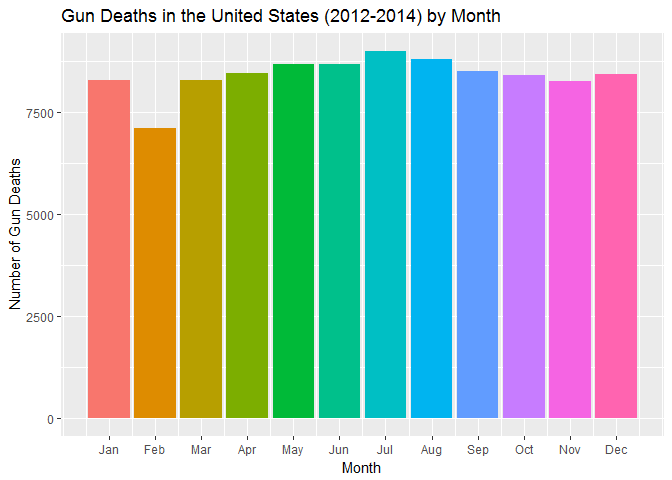
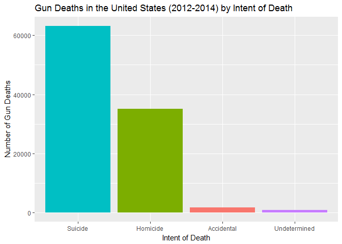
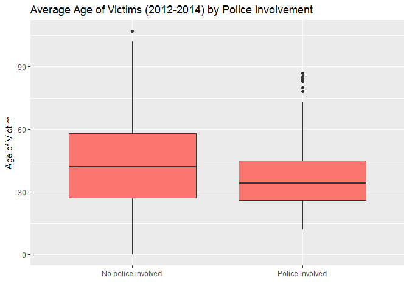
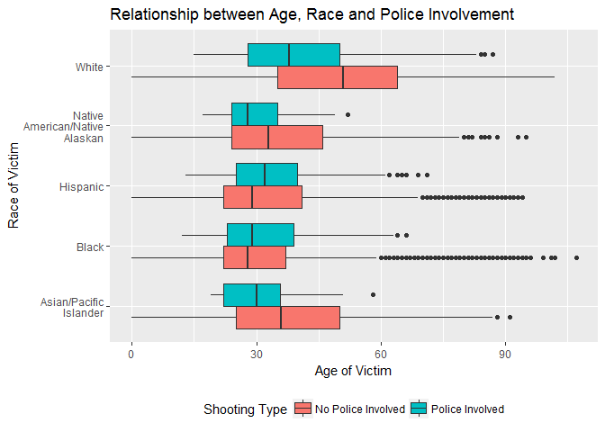

Exploring Gun Deaths in America
================
Cheng Yee Lim

### Get the data

``` r
library(tidyverse)    # load tidyverse packages, including ggplot2
```

    ## Warning: package 'tidyverse' was built under R version 3.3.2

    ## Loading tidyverse: ggplot2
    ## Loading tidyverse: tibble
    ## Loading tidyverse: tidyr
    ## Loading tidyverse: readr
    ## Loading tidyverse: purrr
    ## Loading tidyverse: dplyr

    ## Warning: package 'ggplot2' was built under R version 3.3.2

    ## Warning: package 'tibble' was built under R version 3.3.2

    ## Warning: package 'tidyr' was built under R version 3.3.2

    ## Warning: package 'readr' was built under R version 3.3.2

    ## Warning: package 'purrr' was built under R version 3.3.2

    ## Warning: package 'dplyr' was built under R version 3.3.2

    ## Conflicts with tidy packages ----------------------------------------------

    ## filter(): dplyr, stats
    ## lag():    dplyr, stats

``` r
library(rcfss)
library(knitr)
```

    ## Warning: package 'knitr' was built under R version 3.3.2

``` r
library(stringr)
```

    ## Warning: package 'stringr' was built under R version 3.3.2

``` r
library(scales)
```

    ## Warning: package 'scales' was built under R version 3.3.2

    ## 
    ## Attaching package: 'scales'

    ## The following object is masked from 'package:purrr':
    ## 
    ##     discard

    ## The following objects are masked from 'package:readr':
    ## 
    ##     col_factor, col_numeric

``` r
library(lvplot)

# load the data
data("gun_deaths")
gun_deaths
```

In what month do the most gun deaths occur?
-------------------------------------------

Most gun deaths occur in July.

``` r
count(gun_deaths, month) %>%
  kable(caption = "Gun Deaths in the United States (2012-2014) by Month", 
        col.names = c("Month", "Number of Deaths"))
```

|  Month|  Number of Deaths|
|------:|-----------------:|
|      1|              8273|
|      2|              7093|
|      3|              8289|
|      4|              8455|
|      5|              8669|
|      6|              8677|
|      7|              8989|
|      8|              8783|
|      9|              8508|
|     10|              8406|
|     11|              8243|
|     12|              8413|

### With a bar chart

``` r
ggplot(data = gun_deaths) + 
  geom_bar(aes(month, fill = factor(month))) + 
  ggtitle("Gun Deaths in the United States (2012-2014) by Month") + 
  xlab("Month") + 
  ylab("Number of Gun Deaths") + 
  scale_fill_discrete(guide=FALSE) +
  scale_x_continuous(
    breaks = 
      round(seq(min(gun_deaths$month), max(gun_deaths$month), by = 1.0),1), 
    labels = 
      c("Jan", "Feb", "Mar", "Apr", "May", "Jun", 
               "Jul", "Aug", "Sep", "Oct", "Nov", "Dec")) 
```



### With a line chart

``` r
month.gun <- gun_deaths %>%
  group_by(month) %>%
  summarize(count = n())

ggplot(data=month.gun) + 
  geom_line(aes(month, count)) +
  ggtitle("Gun Deaths in the United States (2012-2014) by Month") + 
  xlab("Month") + 
  ylab("Number of Gun Deaths") + 
  ylim(0, 9000) + 
  scale_x_continuous(
    breaks = 
      round(seq(min(gun_deaths$month), max(gun_deaths$month), by = 1.0),1), 
    labels = 
      c("Jan", "Feb", "Mar", "Apr", "May", "Jun", 
        "Jul", "Aug", "Sep", "Oct", "Nov", "Dec"))
```


What is the most common intent in gun deaths? Do most people killed by guns die in suicides, homicides, or accidental shootings?
--------------------------------------------------------------------------------------------------------------------------------

The most common intent in gun deaths is suicide.

``` r
count(gun_deaths, intent) %>%
  kable(caption = "Gun Deaths in the United States (2012-2014) by Intent", 
        col.names = c("Intent of Shooting", "Number of Deaths"))
```

| Intent of Shooting |  Number of Deaths|
|:-------------------|-----------------:|
| Accidental         |              1639|
| Homicide           |             35176|
| Suicide            |             63175|
| Undetermined       |               807|
| NA                 |                 1|

### With a bar graph

``` r
intent.gun <- filter(gun_deaths, intent!= "NA")
ggplot(data = intent.gun) + 
  geom_bar(aes(intent, fill = factor(intent))) + 
  ggtitle("Gun Deaths in the United States (2012-2014) by Intent of Death") + 
  xlab("Intent of Death") + 
  ylab("Number of Gun Deaths") + 
  scale_fill_discrete(guide=FALSE) +
  scale_x_discrete(
    limits=c("Suicide","Homicide","Accidental", "Undetermined"))
```



What is the average age of females killed by guns?
--------------------------------------------------

The average age of females killed by guns is 43.74.

``` r
female.age.guns <- gun_deaths %>%
  group_by(sex) %>%
  filter(age > 0) %>%
  summarize(female.age = mean(age, na.rm = TRUE))

kable(female.age.guns, 
      caption = "Average Age of Gun Death Victims (2012-2014) by Sex", 
      col.names = c("Sex", "Average Age"), digits = 2)
```

| Sex |  Average Age|
|:----|------------:|
| F   |        43.74|
| M   |        43.89|

### Using a bar graph

``` r
ggplot(data = female.age.guns) + 
  geom_bar(aes(sex, female.age), stat = "identity") + 
  ggtitle("Average Age of Gun Deaths Victims (2012-2014) by Sex") +
  xlab("Sex of Victim") + 
  ylab("Age of Victim") + 
  scale_x_discrete(breaks =c("F", "M"), labels = c("Female", "Male"))
```


### Using a boxplot

``` r
ggplot(data=gun_deaths) + 
  geom_boxplot(aes(sex, age)) + 
  ggtitle("Average Age of Gun Deaths Victims (2012-2014) by Sex") + 
  xlab("Sex of Victim") + 
  ylab("Age of Victim") +
  scale_x_discrete(breaks =c("F", "M"), labels = c("Female", "Male"))
```

    ## Warning: Removed 18 rows containing non-finite values (stat_boxplot).


### Using a violin plot

``` r
ggplot(data=gun_deaths) + 
  geom_violin(aes(sex, age)) + 
  ggtitle("Average Age of Victims (2012-2014) by Sex") + 
  xlab("Sex") + 
  ylab("Age of Victim") +
  scale_x_discrete(breaks =c("F", "M"), labels = c("Female", "Male"))
```

    ## Warning: Removed 18 rows containing non-finite values (stat_ydensity).


### Using a letter-value boxplot

``` r
ggplot(data=gun_deaths) + 
  geom_lv(aes(sex, age)) + 
  ggtitle("Average Age of Victims (2012-2014) by Sex") + 
  xlab("Sex") + 
  ylab("Age of Victim") +
  scale_x_discrete(breaks =c("F", "M"), labels = c("Female", "Male"))
```


How many white males with at least a high school education were killed by guns in 2012?
---------------------------------------------------------------------------------------

There were 15199 white males with at least a high school education killed by guns in 2012.

``` r
white.highschool <- gun_deaths %>% 
  filter(education!="NA") %>%
  filter(sex == "M") %>%
  filter(race == "White") %>%
  filter(year == 2012) %>%
  filter(education != "Less than HS") %>% 
  summarize(count = n())
```

Which season of the year has the most gun deaths?
-------------------------------------------------

Assuming that:

-   Winter = January-March
-   Spring = April-June
-   Summer = July-September
-   Fall = October-December

Summer season has the most gun deaths.

``` r
gun_deaths$season <- cut(gun_deaths$month,
                         breaks = c(-Inf, 3, 6, 9, Inf),
                         labels = c("Winter","Spring","Summer", "Fall"))

season.gun <- gun_deaths %>%
  group_by(season) %>%
  summarize(count = n())

kable(season.gun, 
      caption = "Gun Deaths in the United States (2012-2014) by Season",
      col.names = c("Season", "Number of Deaths"), digits = 2)
```

| Season |  Number of Deaths|
|:-------|-----------------:|
| Winter |             23655|
| Spring |             25801|
| Summer |             26280|
| Fall   |             25062|

``` r
ggplot(data = gun_deaths) + 
  geom_bar(aes(season, fill = season)) + 
  ggtitle("Gun Deaths in the United States (2012-2014) by Season") + 
  xlab("Season") + 
  ylab("Number of Gun Deaths") + 
  scale_fill_discrete(guide=FALSE)
```


What is the relationship between race and intent?
-------------------------------------------------

Whites who are killed by guns are more likely to die because of suicide, whereas blacks and hispanics are more likely to die because of homicide.

``` r
gun_deaths$newrace <- str_wrap(gun_deaths$race, width = 10)

intent.gun <- gun_deaths %>%
  group_by(race, intent) %>%
  summarize(count= n())

kable(intent.gun, col.names = c("Race of Victim", "Intent of Shooting", "Number of Deaths"))
```

| Race of Victim                 | Intent of Shooting |  Number of Deaths|
|:-------------------------------|:-------------------|-----------------:|
| Asian/Pacific Islander         | Accidental         |                12|
| Asian/Pacific Islander         | Homicide           |               559|
| Asian/Pacific Islander         | Suicide            |               745|
| Asian/Pacific Islander         | Undetermined       |                10|
| Black                          | Accidental         |               328|
| Black                          | Homicide           |             19510|
| Black                          | Suicide            |              3332|
| Black                          | Undetermined       |               126|
| Hispanic                       | Accidental         |               145|
| Hispanic                       | Homicide           |              5634|
| Hispanic                       | Suicide            |              3171|
| Hispanic                       | Undetermined       |                72|
| Native American/Native Alaskan | Accidental         |                22|
| Native American/Native Alaskan | Homicide           |               326|
| Native American/Native Alaskan | Suicide            |               555|
| Native American/Native Alaskan | Undetermined       |                14|
| White                          | Accidental         |              1132|
| White                          | Homicide           |              9147|
| White                          | Suicide            |             55372|
| White                          | Undetermined       |               585|
| White                          | NA                 |                 1|

### Using a horizontal bar graph

``` r
ggplot(data = gun_deaths) + 
  geom_bar(aes(x =newrace, fill=intent), position = "fill") + 
  ggtitle("Gun Deaths in the United States (2012-2014) by Race and Intent") + 
  xlab("Race of Victim") + 
  ylab("Percent of Gun Death Victims") + 
  labs(fill = "Intent") +
  theme(legend.position = "bottom") +
  coord_flip() + 
  ylim(0, 70000) + 
  scale_y_continuous(labels = percent_format())
```

    ## Scale for 'y' is already present. Adding another scale for 'y', which
    ## will replace the existing scale.


Are police-involved gun deaths significantly different from other gun deaths? Assess the relationship between police involvement and age, police involvement and race, and the intersection of all three variables.
-------------------------------------------------------------------------------------------------------------------------------------------------------------------------------------------------------------------

The age of police-involved gun death victims is often younger than other victims.

``` r
cut(gun_deaths$police, breaks = c(-.99,0,1))
gun_deaths$police <- factor(gun_deaths$police)
```

### Investigating police involvement and average age of victims with a boxplot

``` r
ggplot(data=gun_deaths) + 
  geom_boxplot(aes(x = police, y= age, fill='cyl')) + 
  ggtitle("Average Age of Victims (2012-2014) by Police Involvement") +
  ylab("Age of Victim") +
  xlab("") + 
  scale_x_discrete(
    breaks = c(0,1), 
    labels = c("No police involved","Police Involved")) + 
  scale_fill_discrete(guide=FALSE)
```

    ## Warning: Removed 18 rows containing non-finite values (stat_boxplot).



### Investigating percentage of gun death victims by race and policement involvement with a bar graph

There are significantly higher percentage of Hispanic gun death victims, who died due to an officer-involved shooting, when compared to percentage of Hispanic victims who died without police involvement. Conversely, the percentage of victims who were white in a police-involved gun death were smaller than percentage of White victims who died without police involvement.

``` r
gun_deaths$race <- str_wrap(gun_deaths$race, width = 15)
gun_deaths$race <- factor(gun_deaths$race)

ggplot(data = gun_deaths) + 
  geom_bar(aes(x=police, fill=race), position = "fill") + 
  ggtitle("Percentage of Gun Death Victims by Race and Police Involvement") +
  labs(fill = "Race") + 
  ylab("Percent of Gun Death Victims") + 
  xlab("") +
  scale_y_continuous(labels = percent_format()) + 
  scale_x_discrete(breaks = c(0,1), 
                     labels = c("No police involved","Police Involved"))
```


### Relationship between police involvement, race and age

With the exception of the Black gun death victims, the average age of victims who died as a result of an officer-involved shooting was younger than victims who died without police involvement.

``` r
gun_deaths$rac[gun_deaths$race=="Asian/Pacific Islander"] <- 1
```

    ## Warning: Unknown column 'rac'

``` r
gun_deaths$rac[gun_deaths$race=="Black"] <- 2
gun_deaths$rac[gun_deaths$race=="Hispanic"] <- 3
gun_deaths$rac[gun_deaths$race=="Native American/Native Alaskan"] <- 4
gun_deaths$rac[gun_deaths$race=="White"] <- 5
cut(gun_deaths$rac, breaks = c(0,1,2,3,4,5))
```

``` r
ggplot(data = gun_deaths) + 
  geom_boxplot(aes(x=race, y=age, fill=police)) + 
  ggtitle("Relationship between Age, Race and Police Involvement") +
  xlab("Race of Victim") + 
  ylab("Age of Victim") +
  theme(legend.position = "bottom") +
  scale_fill_discrete(name = "Shooting Type",
                      breaks = c("0", "1"),
                      labels = c("No Police Involved", "Police Involved")) +
  coord_flip()
```

    ## Warning: Removed 18 rows containing non-finite values (stat_boxplot).



``` r
ggplot(data = gun_deaths) + 
  geom_boxplot(
    aes(x=police, y=age, fill=race)) + 
  ggtitle("Relationship between Age, Race and Police Involvement") +
  xlab("Shooting Type") + 
  ylab("Age of Victim") +
  labs(fill = "Race of Victim") +
  scale_x_discrete(breaks = c(0,1), 
                     labels = c("No police involved","Police Involved")) +
  theme(legend.position = "bottom") 
```

    ## Warning: Removed 18 rows containing non-finite values (stat_boxplot).


Session info
------------

``` r
# don't modify this chunk
devtools::session_info()
```

    ## Session info --------------------------------------------------------------

    ##  setting  value                       
    ##  version  R version 3.3.1 (2016-06-21)
    ##  system   x86_64, mingw32             
    ##  ui       RTerm                       
    ##  language (EN)                        
    ##  collate  English_United States.1252  
    ##  tz       America/Chicago             
    ##  date     2017-01-18

    ## Packages ------------------------------------------------------------------

    ##  package    * version    date       source                        
    ##  assertthat   0.1        2013-12-06 CRAN (R 3.3.2)                
    ##  backports    1.0.4      2016-10-24 CRAN (R 3.3.2)                
    ##  colorspace   1.3-2      2016-12-14 CRAN (R 3.3.2)                
    ##  DBI          0.5-1      2016-09-10 CRAN (R 3.3.2)                
    ##  devtools     1.12.0     2016-06-24 CRAN (R 3.3.2)                
    ##  digest       0.6.11     2017-01-03 CRAN (R 3.3.2)                
    ##  dplyr      * 0.5.0      2016-06-24 CRAN (R 3.3.2)                
    ##  evaluate     0.10       2016-10-11 CRAN (R 3.3.2)                
    ##  ggplot2    * 2.2.1      2016-12-30 CRAN (R 3.3.2)                
    ##  gtable       0.2.0      2016-02-26 CRAN (R 3.3.2)                
    ##  highr        0.6        2016-05-09 CRAN (R 3.3.2)                
    ##  htmltools    0.3.5      2016-03-21 CRAN (R 3.3.2)                
    ##  knitr      * 1.15.1     2016-11-22 CRAN (R 3.3.2)                
    ##  labeling     0.3        2014-08-23 CRAN (R 3.3.2)                
    ##  lazyeval     0.2.0      2016-06-12 CRAN (R 3.3.2)                
    ##  lvplot     * 0.2.0.9000 2017-01-18 Github (hadley/lvplot@8ce61c7)
    ##  magrittr     1.5        2014-11-22 CRAN (R 3.3.2)                
    ##  memoise      1.0.0      2016-01-29 CRAN (R 3.3.2)                
    ##  munsell      0.4.3      2016-02-13 CRAN (R 3.3.2)                
    ##  plyr         1.8.4      2016-06-08 CRAN (R 3.3.2)                
    ##  purrr      * 0.2.2      2016-06-18 CRAN (R 3.3.2)                
    ##  R6           2.2.0      2016-10-05 CRAN (R 3.3.2)                
    ##  rcfss      * 0.1.0      2017-01-18 Github (uc-cfss/rcfss@5efb9cd)
    ##  Rcpp         0.12.8     2016-11-17 CRAN (R 3.3.2)                
    ##  readr      * 1.0.0      2016-08-03 CRAN (R 3.3.2)                
    ##  rmarkdown    1.3        2016-12-21 CRAN (R 3.3.2)                
    ##  rprojroot    1.1        2016-10-29 CRAN (R 3.3.2)                
    ##  scales     * 0.4.1      2016-11-09 CRAN (R 3.3.2)                
    ##  stringi      1.1.2      2016-10-01 CRAN (R 3.3.2)                
    ##  stringr    * 1.1.0      2016-08-19 CRAN (R 3.3.2)                
    ##  tibble     * 1.2        2016-08-26 CRAN (R 3.3.2)                
    ##  tidyr      * 0.6.0      2016-08-12 CRAN (R 3.3.2)                
    ##  tidyverse  * 1.0.0      2016-09-09 CRAN (R 3.3.2)                
    ##  withr        1.0.2      2016-06-20 CRAN (R 3.3.2)                
    ##  yaml         2.1.14     2016-11-12 CRAN (R 3.3.2)
