World Bank Report on Telecommunications
================
Cheng Yee Lim
February 1, 2017

Introduction
------------

The decade of explosive growth of the Internet has revolutionised the way things work in the world and heralded a new era of communications. The new possibilities enabled by the internet has resultantly led to different developments in telecommunications in countries. In this report, I analyze the recent developments in telecommunications with the changes in fixed telephone, mobile phone and internet subscribers in the United Nation Security Council countries. I also examined the trends of these telecommunication indicators between developed and developing countries. Lastly, I explore the relationship between urbanization and internet adoption, and hypothesize that the share of population living in cities has a positive impact on Internet adoption in poor countries.

Substitution Effect of Telephones and Mobile Phones
---------------------------------------------------

Using the indicators, internet subscribers (per 100 people), mobile phone subscribers (per 100 people) and fixed telephone line subscribers (per 100 people), the bar graphs for each country show the relative change of each type of subscribers to other subscribers. From the graphs of both developed and developing countries, we can see a decreasing trend in the number of fixed telephone line subscribers and an increasing trend in the number of mobile phone subscribers. This can be viewed as a substitution effect between mobile phones and fixed telephone lines. This substitution effect can be attributed to the invention of mobile smartphones, which offer more services than fixed telephone lines. The trend of the number of internet subscribers is more ambiguous, especially among the developing countries.

### Developed Countries

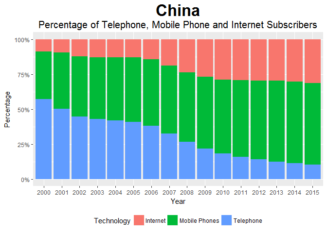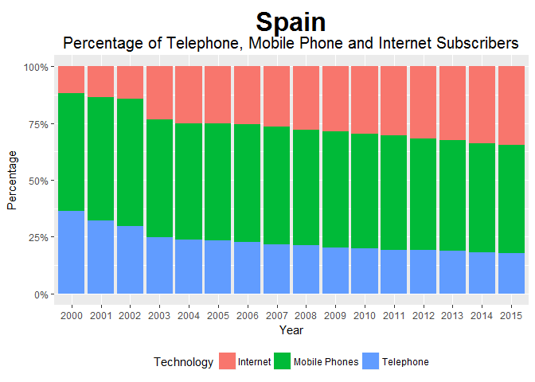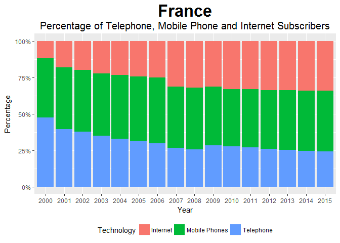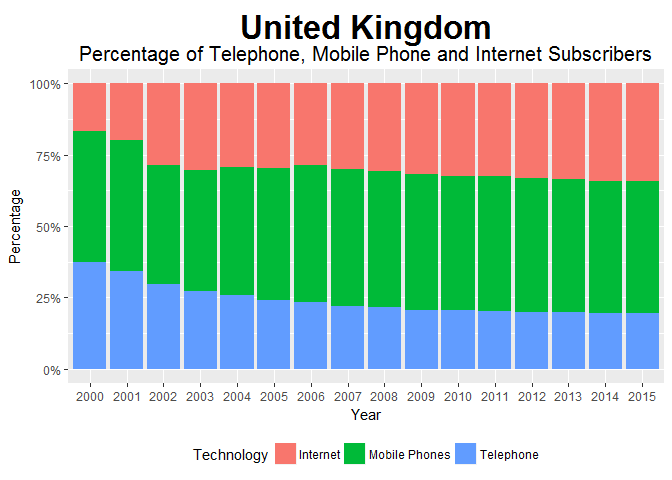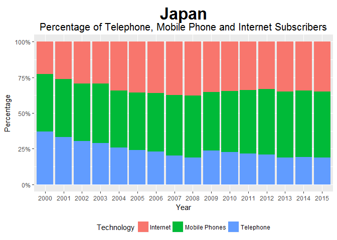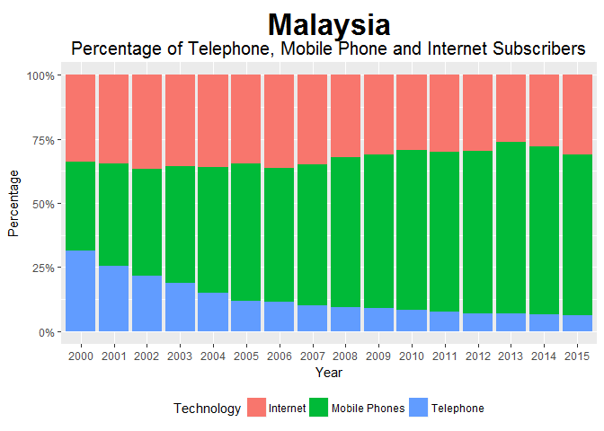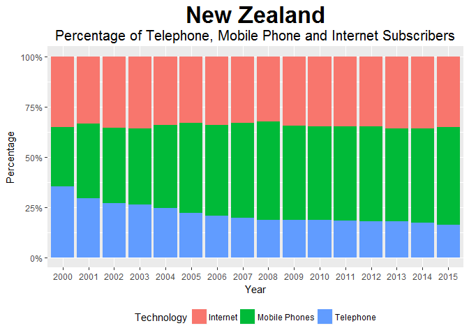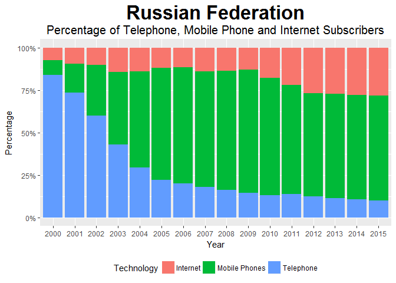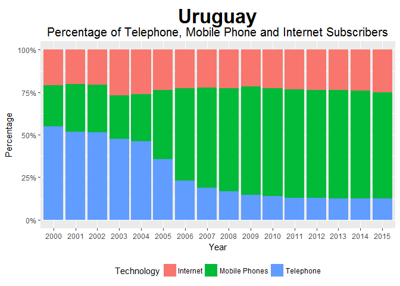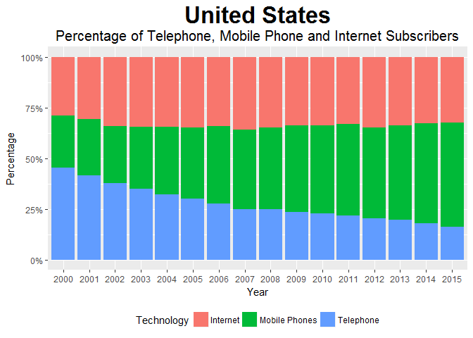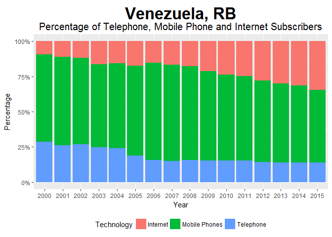

### Developing Countries

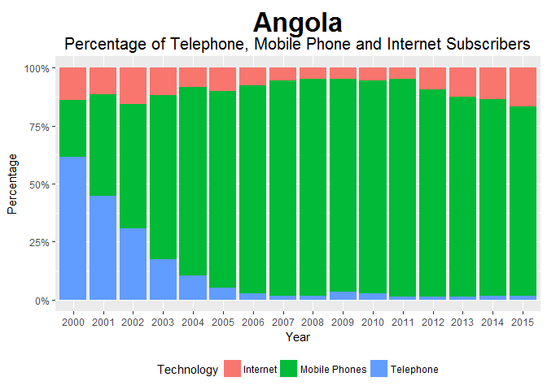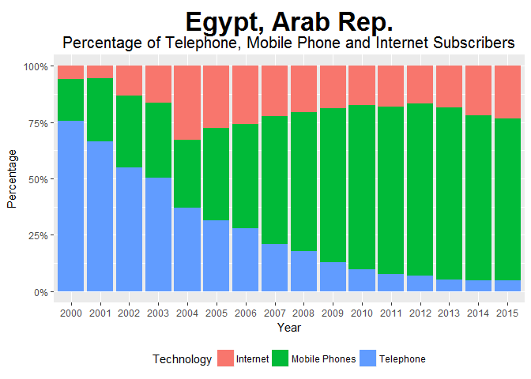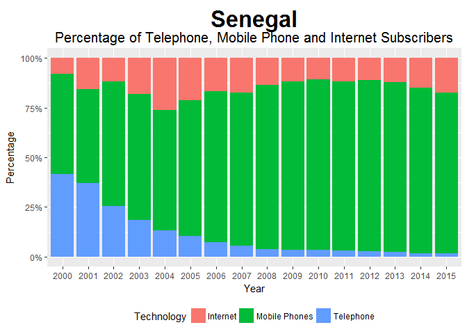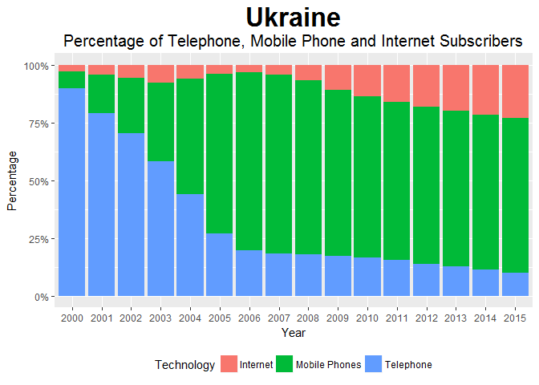

Leapfrogging in Developing Countries
------------------------------------

The substitution effect is much more prominent in developing countries than developed countries. Developing countries are defined as low income and low-middle income countries and developed countries are defined as upper-middle and high income countries in the World Bank Country Income classifications. This corroborates with the view that mobile phones are an example of leapfrog technology, allowing developing countries to reap the benefits of a communication network without the heavy investment in fixed telephone infrastructure. This is also supported by the line charts below, which compares the growth of telephone and mobile phones subscribers in developing and developed countries. The average percentage of fixed telephone subscribers in developing countries never caught up to that of developed countries. But the gap between the average mobile phone subscribers of developed and developing countries narrowed from 2000 to 2015. 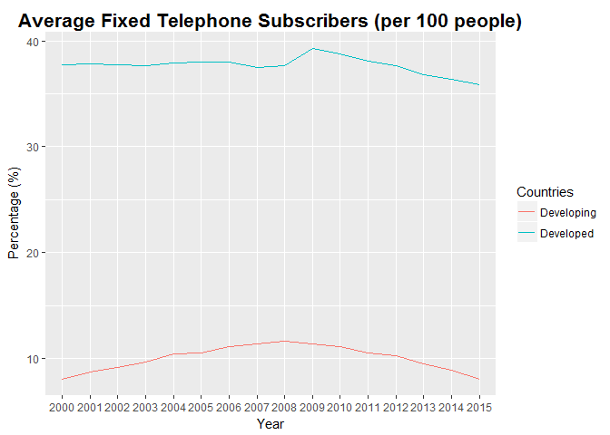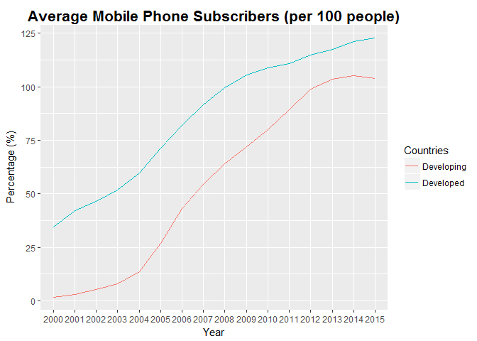

Investigating Internet Adoption
-------------------------------

Lastly, I attempt to clarify the ambiguous trend of internet adoption in countries from the bar graphs. I do so by plotting the average internet subscribers in developed and developing countries. The line graph below shows that internet subscribers have increased in both developed and developing countries, but at a faster rate in developed countries. This is unsurprising as developing countries often lack the wealth and infrastructure to promote widespread adoption of new technologies.

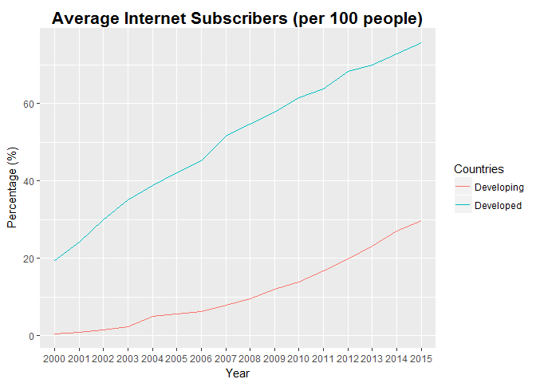

### The role of Urbanization in Internet Adoption

In this case, we use urbanization as a proxy of infrastructure and wealth of a country and conduct a preliminary investigation of the relationship between urbanization and internet adoption. The scatter plot suggests that a higher level of urbanization is often correlated with higher internet adoption in developing countries. This relationship is, however, less clear in developed countries. We can also identify that China is an outlier among the developed countries. Despite having high incomes, China still remains less urbanized and have achieved significantly lower levels of internet adoption than the rest of the developed countries. 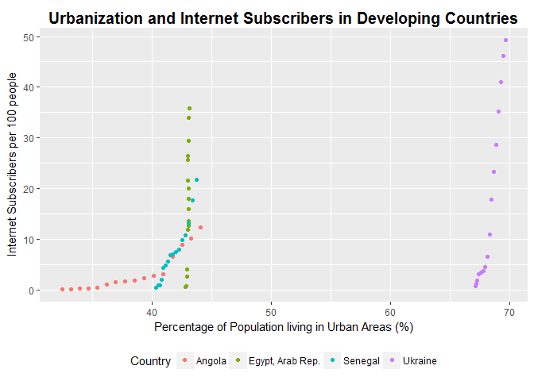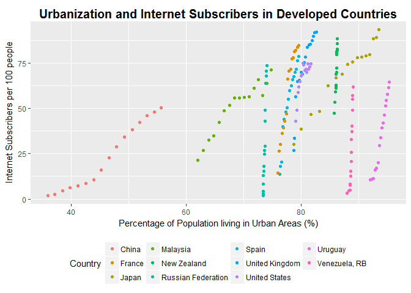
