Exploring World Bank Data
================
Cheng Yee Lim
February 1, 2017

Load necessary libraries
------------------------

``` r
library(tidyverse)
```

    ## Warning: package 'tidyverse' was built under R version 3.3.2

    ## Loading tidyverse: ggplot2
    ## Loading tidyverse: tibble
    ## Loading tidyverse: tidyr
    ## Loading tidyverse: readr
    ## Loading tidyverse: purrr
    ## Loading tidyverse: dplyr

    ## Warning: package 'ggplot2' was built under R version 3.3.2

    ## Warning: package 'tibble' was built under R version 3.3.2

    ## Warning: package 'tidyr' was built under R version 3.3.2

    ## Warning: package 'readr' was built under R version 3.3.2

    ## Warning: package 'purrr' was built under R version 3.3.2

    ## Warning: package 'dplyr' was built under R version 3.3.2

    ## Conflicts with tidy packages ----------------------------------------------

    ## filter(): dplyr, stats
    ## lag():    dplyr, stats

``` r
library(knitr)
```

    ## Warning: package 'knitr' was built under R version 3.3.2

Write a function to import the data files
-----------------------------------------

``` r
import <- function(a) {
  #read datafile 
  sample <- read.csv(file = a,
                     sep = ",",
                     header = T,
                     skip = 4)[, c(1:60)] %>%
    filter((`Indicator.Code` == 'IT.MLT.MAIN.P2') | 
             (`Indicator.Code` == 'IT.NET.USER.P2') |
             (`Indicator.Code` == 'IT.CEL.SETS.P2') |
             (`Indicator.Code` == 'SP.URB.TOTL.IN.ZS')) %>%    
    select(-`Indicator.Code`) %>%
    gather(`X1960`:`X2015`, key = "Year", value = "Data") 
  sample$Year <- substr(sample$Year, 2, 5) #remove redundant X
  sample <- sample %>%
    spread(key = `Indicator.Name`, value = Data, convert = TRUE) %>% 
    filter(Year > 1999)
  return(sample)
}
```

Import the data
---------------

``` r
fileNames <- list.files(path="./data_world_bank/", pattern=".*csv")

for(i in (1:length(fileNames))){
    filepath <- file.path("./data_world_bank", paste(fileNames[i], sep=""))
    if(i==1){
      df1 <- import(filepath)  
    }
    else{
      df2 <- import(filepath)
      df1 <- bind_rows(df1, df2)
    }
}
```

    ## Warning in bind_rows_(x, .id): Unequal factor levels: coercing to character

    ## Warning in bind_rows_(x, .id): Unequal factor levels: coercing to character

Explore the data
----------------

``` r
#rename variable names 
colnames(df1) <- c("country", "countrycode", "year", "tele100", "internet100", "mobile100", "urban")

#defining sub categories of countries - developing and developed 
countriesAll <- unique(df1$country)
countriesDeveloped <- countriesAll[-c(1,3,11,12)]
countriesDeveloping <- countriesAll[c(1,3,11,12)]

#creating dummy variable for developed and developing
df1$developed[df1$country %in% countriesDeveloped] <- 1
df1$developed[df1$country %in% countriesDeveloping] <- 0

#horizontal bar chart to identify the changes in percentage of internet/mobile/telephone users 
userplot <- function(dataframe, countryName) {
  dataframe1 <- dataframe %>%
  filter(country == countryName) %>%
  gather(`mobile100`:`tele100`, key = 'technology', value = 'subscriptions')
  
  plot <- ggplot(data = dataframe1) + 
    geom_bar(aes(y = subscriptions, x = year, fill = technology), 
             stat = "identity", 
             position = "fill") +
    labs(
      x = "Year", 
      y = "Percentage", 
      title = countryName,
      subtitle ="Percentage of Telephone, Mobile Phone and Internet Subscribers",
      fill = "Technology") +
    scale_fill_discrete(
      breaks = c("internet100", "mobile100", "tele100"),
      labels=c("Internet", "Mobile Phones", "Telephone")
      ) + 
    theme(plot.title=element_text(
      size=25, 
      hjust=0.5, 
      face="bold", 
      colour="black", 
      vjust=-1)) + 
    theme(plot.subtitle=element_text(
      size=15, 
      hjust=0.5,
      color="black")) + 
    theme(legend.position = "bottom") + 
    scale_y_continuous(labels =scales::percent)

  print(plot)
}

for(i in (1:length(countriesDeveloped))){
  userplot(df1, countriesDeveloped[i])
}
```

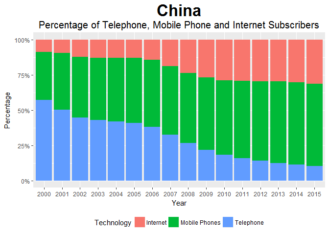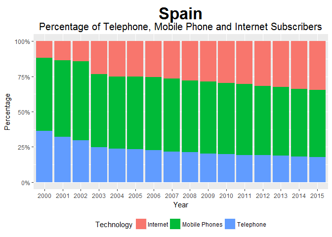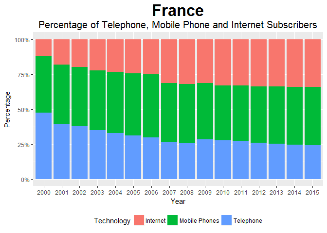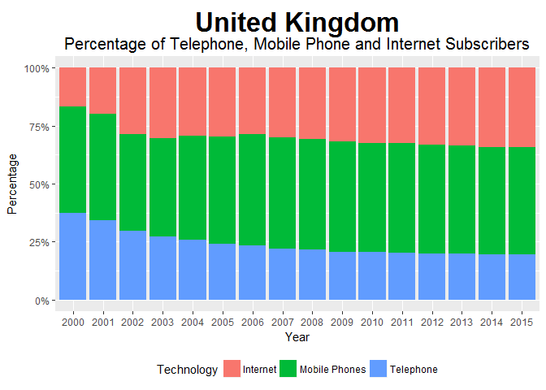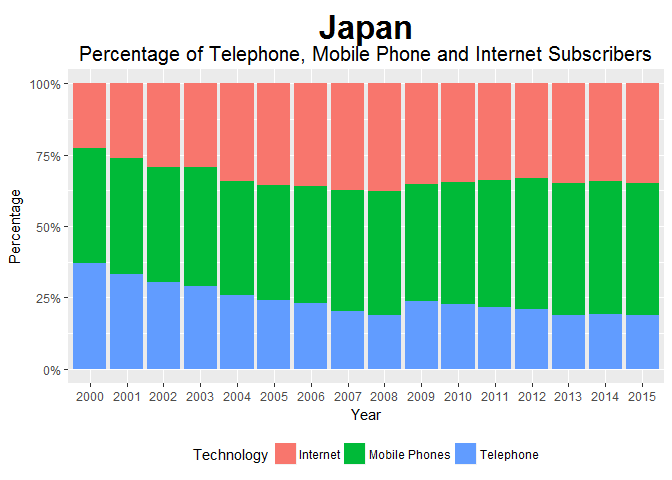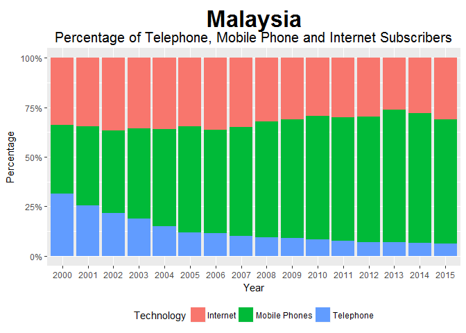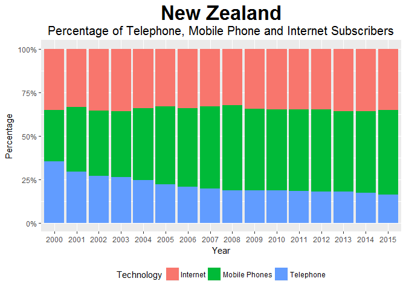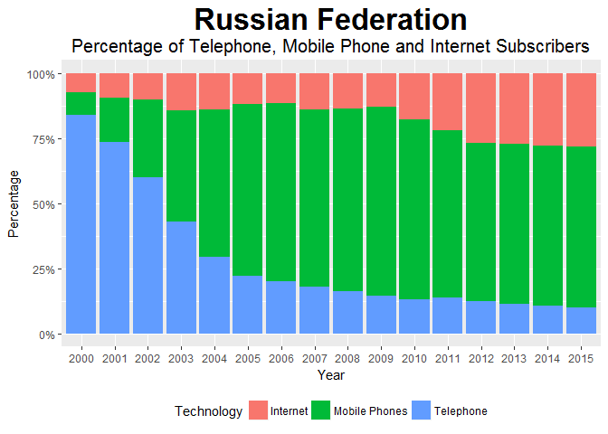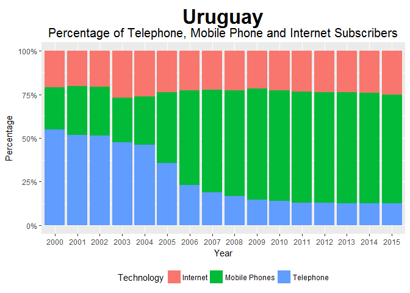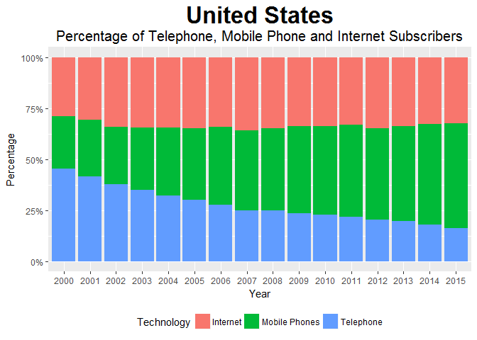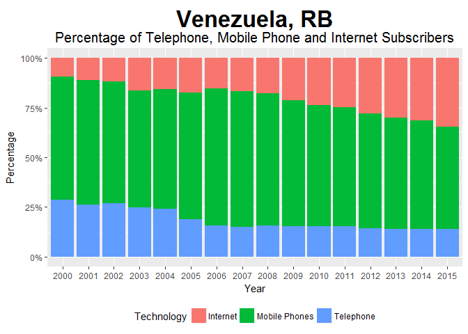

``` r
for(i in (1:length(countriesDeveloping))){
  userplot(df1, countriesDeveloping[i])
}
```

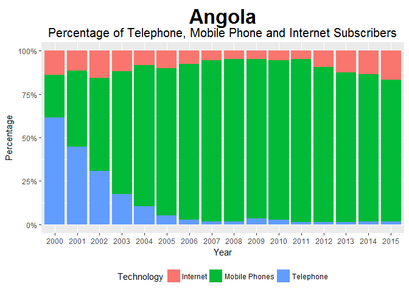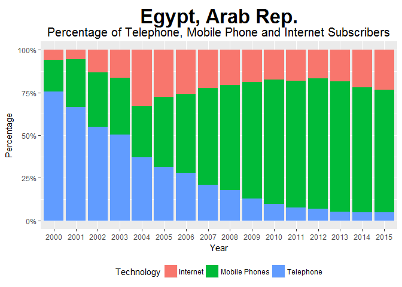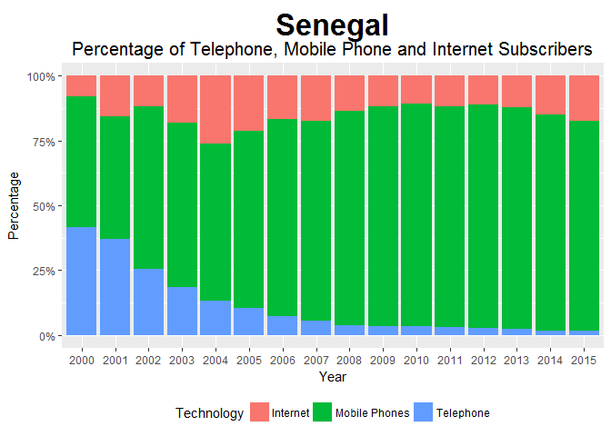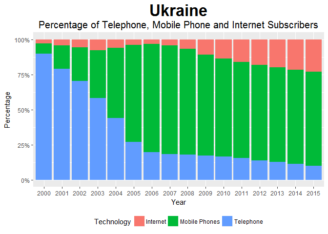

``` r
#Developing-Developed telephone subscribers 
df1 %>%
  group_by(year, developed) %>%
  summarize(
    avgtele = mean(tele100), 
    avgmobile = mean(mobile100), 
    avginternet = mean(internet100)
    ) %>% 
  ggplot() + 
  geom_line(aes(
    x = year, 
    y = avgtele, 
    group=factor(developed), 
    color = factor(developed))) + 
  labs(
    x = "Year", 
    y = "Percentage (%)", 
    title = "Average Fixed Telephone Subscribers (per 100 people)",
    color = "Countries") +
  scale_color_discrete(
    breaks = c(0,1), 
    labels=c("Developing", "Developed")) + 
  theme(plot.title=element_text(
    size=16, 
    hjust=0.5, 
    face="bold", 
    colour="black", 
    vjust=-1))
```

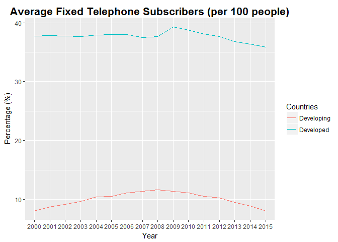

``` r
#Developing-Developed mobile phone subscribers 
df1 %>%
  group_by(year, developed) %>%
  summarize(
    avgtele = mean(tele100), 
    avgmobile = mean(mobile100), 
    avginternet = mean(internet100)
    ) %>% 
  ggplot() + 
  geom_line(aes(
    x = year, 
    y = avgmobile, 
    group=factor(developed), 
    color = factor(developed))) + 
  labs(
    x = "Year", 
    y = "Percentage (%)", 
    title = "Average Mobile Phone Subscribers (per 100 people)",
    color = "Countries") +
  scale_color_discrete(
    breaks = c(0,1), 
    labels=c("Developing", "Developed")) + 
  theme(plot.title=element_text(
    size=16, 
    hjust=0.5, 
    face="bold", 
    colour="black", 
    vjust=-1))
```

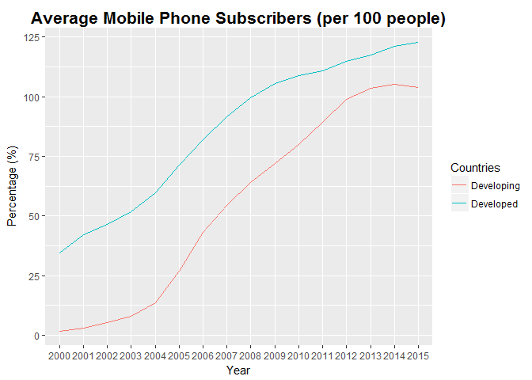

``` r
#Developing-Developed internet subscribers 
df1 %>%
  group_by(year, developed) %>%
  summarize(
    avgtele = mean(tele100), 
    avgmobile = mean(mobile100), 
    avginternet = mean(internet100)
    ) %>% 
  ggplot() + 
  geom_line(aes(
    x = year, 
    y = avginternet, 
    group=factor(developed), 
    color = factor(developed))) + 
  labs(
    x = "Year", 
    y = "Percentage (%)", 
    title = "Average Internet Subscribers (per 100 people)",
    color = "Countries") +
  scale_color_discrete(
    breaks = c(0,1), 
    labels=c("Developing", "Developed")) + 
  theme(plot.title=element_text(
    size=16, 
    hjust=0.5, 
    face="bold", 
    colour="black", 
    vjust=-1))
```

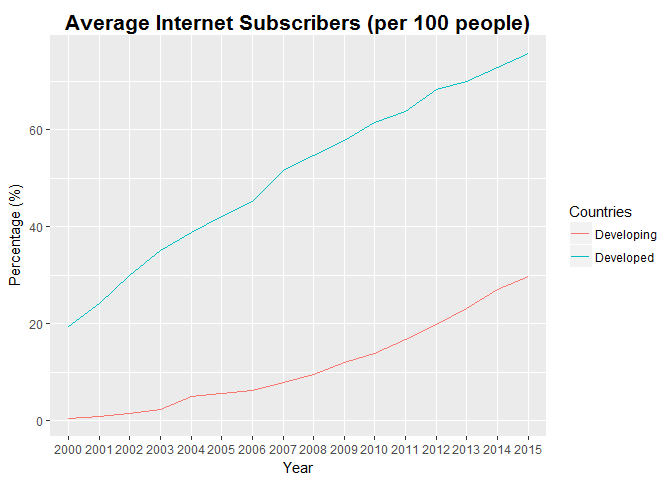

``` r
#Relationship between urbanisation and internet adoption (Developing Countries)
df1 %>% 
  filter(country %in% countriesDeveloping) %>% 
  ggplot() + 
  geom_point(aes(x = urban, y=internet100, color = country), position = "jitter") + 
  labs(
    x = "Percentage of Population living in Urban Areas (%)", 
    y = "Internet Subscribers per 100 people", 
    title = "Relationship between Urbanization and Internet Subscribers",
    color = "Country") +
  theme(plot.title=element_text(
    size=15, 
    hjust=0.5, 
    face="bold", 
    colour="black", 
    vjust=-1))  
```

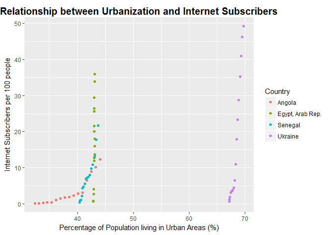

``` r
#Relationship between urbanisation and internet adoption (Developed Countries)
df1 %>% 
  filter(country %in% countriesDeveloped) %>% 
  ggplot() + 
  geom_point(aes(x = urban, y=internet100, color = country), position = "jitter") + 
  labs(
    x = "Percentage of Population living in Urban Areas (%)", 
    y = "Internet Subscribers per 100 people", 
    title = "Relationship between Urbanization and Internet Subscribers",
    color = "Country") +
  theme(plot.title=element_text(
    size=15, 
    hjust=0.5, 
    face="bold", 
    colour="black", 
    vjust=-1))  
```

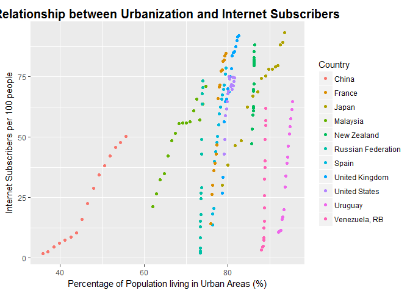

Session info
------------

``` r
devtools::session_info()
```

    ## Session info --------------------------------------------------------------

    ##  setting  value                       
    ##  version  R version 3.3.1 (2016-06-21)
    ##  system   x86_64, mingw32             
    ##  ui       RTerm                       
    ##  language (EN)                        
    ##  collate  English_United States.1252  
    ##  tz       America/Chicago             
    ##  date     2017-02-01

    ## Packages ------------------------------------------------------------------

    ##  package    * version date       source        
    ##  assertthat   0.1     2013-12-06 CRAN (R 3.3.2)
    ##  backports    1.0.4   2016-10-24 CRAN (R 3.3.2)
    ##  colorspace   1.3-2   2016-12-14 CRAN (R 3.3.2)
    ##  DBI          0.5-1   2016-09-10 CRAN (R 3.3.2)
    ##  devtools     1.12.0  2016-06-24 CRAN (R 3.3.2)
    ##  digest       0.6.11  2017-01-03 CRAN (R 3.3.2)
    ##  dplyr      * 0.5.0   2016-06-24 CRAN (R 3.3.2)
    ##  evaluate     0.10    2016-10-11 CRAN (R 3.3.2)
    ##  ggplot2    * 2.2.1   2016-12-30 CRAN (R 3.3.2)
    ##  gtable       0.2.0   2016-02-26 CRAN (R 3.3.2)
    ##  htmltools    0.3.5   2016-03-21 CRAN (R 3.3.2)
    ##  knitr      * 1.15.1  2016-11-22 CRAN (R 3.3.2)
    ##  labeling     0.3     2014-08-23 CRAN (R 3.3.2)
    ##  lazyeval     0.2.0   2016-06-12 CRAN (R 3.3.2)
    ##  magrittr     1.5     2014-11-22 CRAN (R 3.3.2)
    ##  memoise      1.0.0   2016-01-29 CRAN (R 3.3.2)
    ##  munsell      0.4.3   2016-02-13 CRAN (R 3.3.2)
    ##  plyr         1.8.4   2016-06-08 CRAN (R 3.3.2)
    ##  purrr      * 0.2.2   2016-06-18 CRAN (R 3.3.2)
    ##  R6           2.2.0   2016-10-05 CRAN (R 3.3.2)
    ##  Rcpp         0.12.8  2016-11-17 CRAN (R 3.3.2)
    ##  readr      * 1.0.0   2016-08-03 CRAN (R 3.3.2)
    ##  rmarkdown    1.3     2016-12-21 CRAN (R 3.3.2)
    ##  rprojroot    1.1     2016-10-29 CRAN (R 3.3.2)
    ##  scales       0.4.1   2016-11-09 CRAN (R 3.3.2)
    ##  stringi      1.1.2   2016-10-01 CRAN (R 3.3.2)
    ##  stringr      1.1.0   2016-08-19 CRAN (R 3.3.2)
    ##  tibble     * 1.2     2016-08-26 CRAN (R 3.3.2)
    ##  tidyr      * 0.6.0   2016-08-12 CRAN (R 3.3.2)
    ##  tidyverse  * 1.0.0   2016-09-09 CRAN (R 3.3.2)
    ##  withr        1.0.2   2016-06-20 CRAN (R 3.3.2)
    ##  yaml         2.1.14  2016-11-12 CRAN (R 3.3.2)
