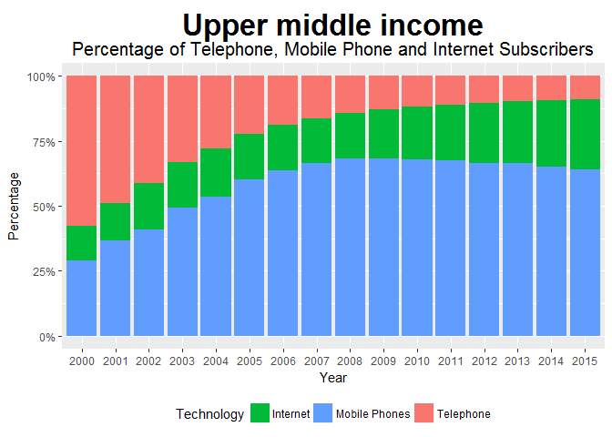

Exploring Telecommunications and Aid Data
================
Cheng Yee Lim
February 6, 2017

Load necessary libraries
------------------------

``` r
library(tidyverse)
library(foreign)
library(stringr)
library(ggmap)
```

``` r
## Write a function to import the data files
import <- function(a) {
  #read datafile 
  sample <- read.csv(file = a,
                     sep = ",",
                     header = T,
                     skip = 4)[, c(1:60)] %>%
  filter((`Indicator.Code` == 'IT.MLT.MAIN.P2') | 
           (`Indicator.Code` == 'IT.NET.USER.P2') |
           (`Indicator.Code` == 'IT.CEL.SETS.P2') |
           (`Indicator.Code` == 'DT.ODA.ODAT.CD') |
           (`Indicator.Code` == 'DT.ODA.OATL.CD') |
           (`Indicator.Code` == 'DT.ODA.ALLD.CD') |
           (`Indicator.Code` == 'SI.POV.DDAY') |
           (`Indicator.Code` == 'SI.DST.FRST.20')) %>%    
  select(-`Indicator.Code`) %>%
  gather(`X1960`:`X2015`, key = "Year", value = "Data") 
sample$Year <- substr(sample$Year, 2, 5) #remove redundant X
sample <- sample %>%
  spread(key = `Indicator.Name`, value = Data, convert = TRUE) %>% 
  filter(Year > 1999)

  return(sample)
}
```

Import and tidy the data
------------------------

``` r
#import core data files 
infrastructure <- import("./data/infrastructure.csv")
aid <- import("./data/aid_effectiveness.csv")

#import country labels 
countries <- read.csv(file = "./data/labels/aid_effectiveness_countries.csv",
                      sep = ",", 
                      header = TRUE)[ , c(1:3)] %>% 
  purrr::set_names(c("Country.Code", "region", "income"))

#import lat-long coords of countries
world.dbf <- read.dbf("./map/TM_WORLD_BORDERS-0.3.dbf", as.is = FALSE) %>%
  select(`ISO3`, `LON`, `LAT`) %>%
  purrr::set_names(c("Country.Code", "long", "lat"))

#merge information of countries with aid_effectiveness + infrastructure dataset
df1 <- left_join(aid, infrastructure, by = c("Country.Code", "Year"))
df1 <- left_join(df1, countries, by = "Country.Code")
df1 <- left_join(df1, world.dbf, by = "Country.Code") %>%
  select(-`Country.Name.y`) %>%
  purrr::set_names(c("country", "countrycode", "year", "income20", "official_aid",
                     "aid_all", "oda", "poverty_ratio", "fixed_tele100", "internet100",                      "mobile100", "region", "income", "long", "lat")) %>%
  filter(!(is.na(long)))

#create new variable for developed economies
df1$developed[df1$income == "High income" | df1$income == "Upper middle income"] <- 1
df1$developed[df1$income == "Low income" | df1$income == "Lower middle income"] <- 0
```

``` r
user <- df1 %>% 
  filter(!(is.na(fixed_tele100)) & 
           !(is.na(mobile100)) & 
           !(is.na(internet100))) %>%
  group_by(income, year) %>%
  summarize(fixed_tele100 = mean(fixed_tele100), 
            mobile100 = mean(mobile100), 
            internet100 = mean(internet100)) %>%
  gather(`fixed_tele100`:`internet100`, 
         key = 'technology', 
         value = 'subscriptions')

user_income <- function(dataframe, incomeGroup) {
  dataframe %>%
  filter(income == incomeGroup) %>%
    ggplot() + 
    geom_bar(aes(y = subscriptions, x = year, fill = technology), 
             stat = "identity", 
             position = "fill") +
    labs(
      x = "Year", 
      y = "Percentage", 
      title = incomeGroup,
      subtitle ="Percentage of Telephone, Mobile Phone and Internet Subscribers",
      fill = "Technology") +
    scale_fill_discrete(
      breaks = c("internet100", "mobile100", "fixed_tele100"),
      labels=c("Internet", "Mobile Phones", "Telephone")
      ) + 
    theme(plot.title=element_text(
      size=25, 
      hjust=0.5, 
      face="bold", 
      colour="black", 
      vjust=-1)) + 
    theme(plot.subtitle=element_text(
      size=15, 
      hjust=0.5,
      color="black")) + 
    theme(legend.position = "bottom") + 
    scale_y_continuous(labels =scales::percent)
}

#plots by income classification
user_income(user, "Low income")
```


``` r
user_income(user, "Lower middle income")
```


``` r
user_income(user, "Upper middle income")
```



``` r
user_income(user, "High income")
```


``` r
#Developing-Developed telephone subscribers 
df1 %>%
  group_by(year, developed) %>%
  filter(!(is.na(fixed_tele100)) & 
           !(is.na(mobile100)) & 
           !(is.na(internet100))) %>%
  summarize(
    avgtele = mean(fixed_tele100), 
    avgmobile = mean(mobile100), 
    avginternet = mean(internet100)
    ) %>% 
  ggplot() + 
  geom_line(aes(
    x = year, 
    y = avgtele, 
    group=factor(developed), 
    color = factor(developed))) + 
  labs(
    x = "Year", 
    y = "Percentage (%)", 
    title = "Average Fixed Telephone Subscribers (per 100 people)",
    color = "Countries") +
  scale_color_discrete(
    breaks = c(0,1), 
    labels=c("Developing", "Developed")) + 
  theme(plot.title=element_text(
    size=16, 
    hjust=0.5, 
    face="bold", 
    colour="black", 
    vjust=-1))
```


``` r
#Developing-Developed mobile phone subscribers 
df1 %>%
  group_by(year, developed) %>%
  filter(!(is.na(fixed_tele100)) & 
           !(is.na(mobile100)) & 
           !(is.na(internet100))) %>%
  summarize(
    avgtele = mean(fixed_tele100), 
    avgmobile = mean(mobile100), 
    avginternet = mean(internet100)
    ) %>% 
  ggplot() + 
  geom_line(aes(
    x = year, 
    y = avgmobile, 
    group=factor(developed), 
    color = factor(developed))) + 
  labs(
    x = "Year", 
    y = "Percentage (%)", 
    title = "Average Mobile Phone Subscribers (per 100 people)",
    color = "Countries") +
  scale_color_discrete(
    breaks = c(0,1), 
    labels=c("Developing", "Developed")) + 
  theme(plot.title=element_text(
    size=16, 
    hjust=0.5, 
    face="bold", 
    colour="black", 
    vjust=-1))
```


``` r
#load world map shape file 
world <- map_data("world")
world <- world[world$region != "Antarctica",] # exclude antarctica

df1$internet100[is.na(df1$internet100) == TRUE] <- 0

#function plotting a map of internet adoption of all countries
internet_map <- function(dataframe, yr, title){
  dataframe %>%
    filter(year == yr) %>%
  ggplot() + 
    geom_map(map = world,
             aes(x = long, 
                 y = lat, 
                 map_id = country, 
                 fill = internet100)) +
  ggtitle(title) +
    ylim(-60,100) + 
    xlim(-150, 200) + 
    scale_fill_gradient(name="Percent", 
                        breaks = c(0, 20, 40, 60, 80, 100), 
                        limits=c(0,100), 
                        low="yellow", 
                        high="darkgreen") + 
    theme(
      axis.text.x = element_blank(),
      axis.text.y = element_blank(),
      axis.ticks = element_blank(),
      legend.position = "bottom", 
      panel.grid.major = element_blank(), 
      panel.grid.minor = element_blank(),
      plot.title = element_text(hjust = 0.5)) + 
    labs(x = "", y = "")
}

#plot internet maps
internet_map(df1, 2005, title = "Internet users (per 100 people) in 2005")
```


``` r
internet_map(df1, 2010, title = "Internet users (per 100 people) in 2010")
```


``` r
internet_map(df1, 2015, title = "Internet users (per 100 people) in 2015")
```


``` r
#Developing-Developed internet subscribers 
df1 %>%
  group_by(year, developed) %>%
  filter(!(is.na(fixed_tele100)) & 
           !(is.na(mobile100)) & 
           !(is.na(internet100))) %>%
  summarize(
    avgtele = mean(fixed_tele100), 
    avgmobile = mean(mobile100), 
    avginternet = mean(internet100)
    ) %>% 
  ggplot() + 
  geom_line(aes(
    x = year, 
    y = avginternet, 
    group=factor(developed), 
    color = factor(developed))) + 
  labs(
    x = "Year", 
    y = "Percentage (%)", 
    title = "The Digital Gap: Average Internet Subscribers",
    color = "Countries") +
  scale_color_discrete(
    breaks = c(0,1), 
    labels=c("Developing", "Developed")) + 
  theme(plot.title=element_text(
    size=16, 
    hjust=0.5, 
    face="bold", 
    colour="black", 
    vjust=-1))
```


``` r
income_map <- function(dataframe, yr, title){
  dataframe %>%
    filter(year == yr) %>%
  ggplot() + 
    geom_map(map = world,
             aes(x = long, y = lat, map_id = country, fill = income)) +
  ggtitle(title) +
    ylim(-60,100) + 
    xlim(-150, 200) + 
    theme(
      axis.text.x = element_blank(),
      axis.text.y = element_blank(),
      axis.ticks = element_blank(),
      legend.position = "bottom", 
      panel.grid.major = element_blank(), 
      panel.grid.minor = element_blank(),
      plot.title = element_text(hjust = 0.5)) + 
    labs(x = "", y = "")
}

income_map(df1, 2015, title = "Classifications of Countries based on Income in 2015")
```


``` r
#scatterplot of aid and internet users
df1 %>%
  filter(income == "Low income"  | income == "Lower middle income") %>%
  ggplot() + 
  geom_point(aes(y = oda, x = internet100, color = region)) + 
  geom_smooth(aes(y = oda, x = internet100)) + 
  ylim(0, 2*10^9) + 
  xlim(0, 60) +
  labs(x = "Internet users (per 100 people)", 
       y = "Official Development Aid") +
  scale_fill_discrete(name = "Region") +
  theme(legend.position = "bottom")
```


