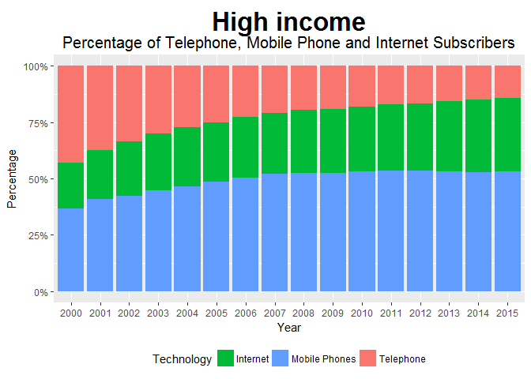

Exploring Telecommunications and Aid Data
================
Cheng Yee Lim
February 6, 2017

Introduction
------------

The decade of explosive growth of the Internet has revolutionised the way things work in the world and heralded a new era of communications. The new possibilities enabled by the internet has resultantly led to different developments in telecommunications in countries. In this report, I analyze the recent developments in telecommunications with the changes in fixed telephone, mobile phone and internet subscribers by country, and by categorizing countries into developed and developing economies. Furthermore, I investigate the possibility of Official Development Assistance as a panacea to the widening digital divide between the developed and developing economies.

Substitution Effect of Telephones and Mobile Phones
---------------------------------------------------

Using the indicators, internet subscribers (per 100 people), mobile phone subscribers (per 100 people) and fixed telephone line subscribers (per 100 people), the bar graphs show the relative change of each type of subscribers to other subscribers. From the graphs of low, lower-middle, upper-middle and high income countries, we can see a decreasing trend in the number of fixed telephone line subscribers and an increasing trend in the number of mobile phone subscribers. This can be viewed as a substitution effect between mobile phones and fixed telephone lines in all countries. If you would like to view the relative change of each type of telecommunication subscriber for a particular country, you could refer to the [appendix](https://github.com/limchengyee/hw05/blob/master/appendix.md). This substitution effect can be attributed to the invention of mobile smartphones, which offer more services than fixed telephone lines. The trend of the number of internet subscribers is more ambiguous, especially among the developing countries.

Leapfrogging in Developing Countries
------------------------------------

The substitution effect is much more prominent in developing countries than developed countries. Developing countries are defined as low income and low-middle income countries and developed countries are defined as upper-middle and high income countries in the World Bank Country Income classifications. This corroborates with the view that mobile phones are an example of leapfrog technology, allowing developing countries to reap the benefits of a communication network without the heavy investment in fixed telephone infrastructure. This is also supported by the line charts below, which compares the growth of telephone and mobile phones subscribers in developing and developed countries. The average percentage of fixed telephone subscribers in developing countries never caught up to that of developed countries. But the gap between the average mobile phone subscribers of developed and developing countries narrowed from 2000 to 2015.

Investigating Internet Adoption
-------------------------------

As the trend of internet adoption was unambiguous, I attempt to explore the trend of internet adoption and investigate its relationship with aid, especially in developing countries. I begin the exploration of internet adoption by plotting the adoption rates of countries on a world map.

From the world map, we can infer that the internet has grown substantially over the last decade. The shades of the world map have turned into darker colors every 5 years. However, Africa is the only continent with countries, which have internet adoption rates less than 20% in 2015. This is unsurprising, as the Africa continent consists the most low income countries (classified by the World bank) and often lack the wealth and infrastructure to promote widespread adoption of new technologies.

However, these statistics are also worrying due to the widening digital gap between the haves and the have-nots. Digital capabilities and in particular the capability to productively use the Internet increasingly determine which companies, industries and countries create or lose value. The key fear is, instead of enabling developing economies to leapfrog and catch up with the developed economies, information technology widens the chasm between richer nations and those who lack the skills, infrastructure and resources. It is therefore of critical importance that developing countries swiftly abridge the digital gap that separates them from developed economies.

Understanding the pertinence of ameliorating the digital gap, one way developing economies could access substantial funds to invest in the Internet is through the Official Development Assistance (ODA). The ODA is an official financing administered to promote economic development and welfare of developing nations. Sub-Saharan Africa is the region that received the most ODA in the last ten years, followed by Middle East and North Africa, and South Asia. Besides directly using ODA to invest in internet infrastructure, such as laying out fibre optic cables, and improving internet access, economic growth caused by ODA can also result in positive spillovers in internet adoption.

The scatterplot shows a preliminary positive relationship between ODA and internet adoption in low income and lower-middle income countries. However, the positive relationship is not very robust as there are many points in the scatterplot which deviate from the predicted positive relationship. These deviations could be a result of which sectors the country invested the ODA in, quality of institutions and corruption in developing countries.

Conclusion
----------

In conclusion, we found that there is indeed a substitution effect between telephone and mobile phones globally, but this effect is much more pronounced in developing countries than developed countries. In fact, mobile phones have become a form of "leapfrog" technology, allowing developing economies to skip the phase of telephone adoption. While mobile phone adoption rates have reached widespread adoption, internet adoption remains sluggish in developing economies and the ODA has hardly been the solution to the slow growth.
