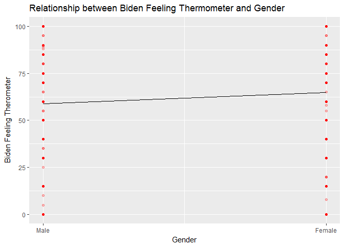
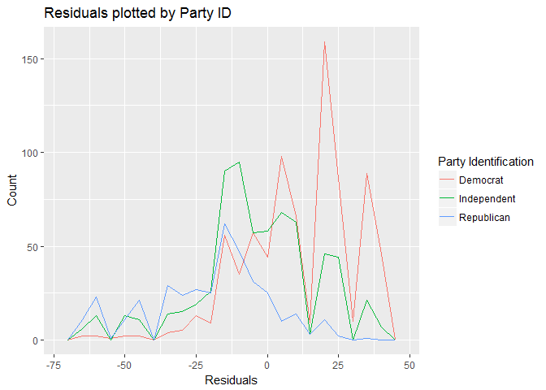
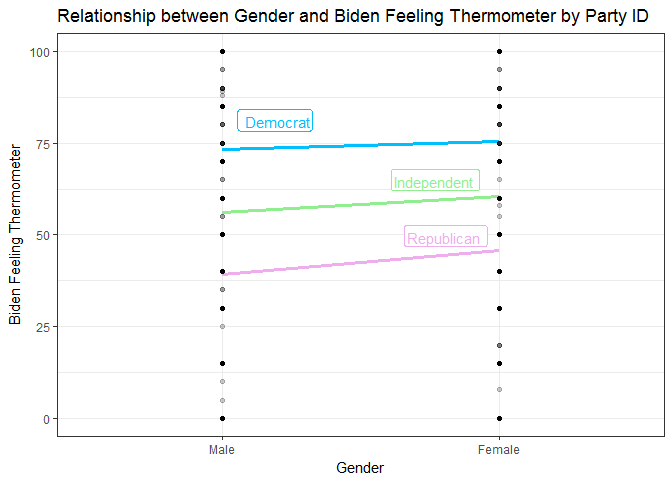

Joe Biden Feeling Thermometer
================
Cheng Yee Lim
February 14, 2017

Question 1
----------

``` r
joe <- read.csv("./data/biden.csv") %>%
  filter(!is.na(biden) & !is.na(female) & !is.na(pid)) 

joe_mod <- lm(biden ~ female, data = joe) 
tidy(joe_mod) %>% 
  kable()
```

| term        |   estimate|  std.error|  statistic|  p.value|
|:------------|----------:|----------:|----------:|--------:|
| (Intercept) |  58.746341|  0.8151831|  72.065214|        0|
| female      |   6.029588|  1.0943960|   5.509512|        0|

``` r
joe %>%
  add_predictions(joe_mod) %>%
  ggplot() + 
  geom_point(aes(x = female, y = biden), 
             alpha = 1/4, 
             color = "red") + 
  geom_line(aes(x = female, y = pred)) + 
  labs(x = "Gender", 
       y = "Biden Feeling Therometer") + 
  scale_x_continuous(breaks =  c(0, 1), labels = c("Male", "Female")) + 
  ggtitle("Relationship between Biden Feeling Thermometer and Gender")
```



There appears to be a significant relationship between gender and feelings towards Joe Biden. The positive gradient of line graph plotted suggests that females have a higher feeling thermometer rating for Joe Biden than males.

Question 2
----------

The residuals of the single gender variable model are all not normally distributed around zero for the Democrat-affliated, Independent, Republican-affliated individuals. In fact, party ID affects the residuals of the single gender variable model. The residuals for the Democrat-affliated individuals are more positive than both Independent and Republican-affliated individuals. Independent individuals have a more positive distribution of residuals than Republican-affliated individuals.

``` r
joe %>% 
  add_residuals(joe_mod) %>%
  ggplot() +
  geom_freqpoly(aes(x = resid, color = factor(pid)), binwidth = 5) + 
  labs(x = "Residuals", 
       y = "Count") + 
  scale_color_discrete(name = "Party Identification", 
                       breaks = c(0, 1, 2),
                       labels = c("Democrat", "Independent", "Republican")) + 
  ggtitle("Residuals plotted by Party ID")
```



Question 3
----------

The distrbution of residuals were not similar for Democrats, Independent and Republicans, thus we would expect the intercepts and coefficients for the regressions for each party ID to be significantly different. Since the distribution of residuals are more positive for Democrats and Independent individuals, we would expect the predicted values of Biden feeling thermometer to follow this order: Republic &lt; Independent &lt; Democrat. This confirms our conclusions of that party ID affects the residuals, biden feeling thermometer values are more positive for democrats, then independents, and lastly, republicans.

``` r
joe_dem <- lm(biden ~ female, joe, subset = (pid == 0)) 
tidy(joe_dem) %>% 
  kable()
```

| term        |   estimate|  std.error|  statistic|  p.value|
|:------------|----------:|----------:|----------:|--------:|
| (Intercept) |  73.236066|   1.077470|  67.970403|  0.00000|
| female      |   2.092506|   1.372432|   1.524671|  0.12774|

``` r
joe_ind <- lm(biden ~ female, joe, subset = (pid == 1)) 
tidy(joe_ind) %>% 
  kable()
```

| term        |   estimate|  std.error|  statistic|   p.value|
|:------------|----------:|----------:|----------:|---------:|
| (Intercept) |  56.104478|   1.140969|  49.172635|  0.000000|
| female      |   4.464385|   1.614782|   2.764698|  0.005855|

``` r
joe_rep <- lm(biden ~ female, joe, subset = (pid == 2)) 
tidy(joe_rep) %>% 
  kable()
```

| term        |   estimate|  std.error|  statistic|    p.value|
|:------------|----------:|----------:|----------:|----------:|
| (Intercept) |  39.111111|   1.552348|  25.194813|  0.0000000|
| female      |   6.646465|   2.144877|   3.098763|  0.0020895|

``` r
joe %>% 
  spread_predictions(joe_dem, joe_ind, joe_rep) %>%
  ggplot() + 
  geom_line(aes(x = female, y = joe_dem), color = "deepskyblue", size = 1.2) + 
  geom_label(aes(x = female, 
                 y = joe_dem, 
                 label = "Democrat", 
                 vjust = -0.5, 
                 hjust = 3.5), 
             color = "deepskyblue") +
  geom_line(aes(x = female, y = joe_ind), color = "lightgreen", size = 1.2) + 
  geom_label(aes(x = female, 
                 y = joe_ind,
                 label = "Independent",
                 vjust = -1, 
                 hjust = -1.9), color = "lightgreen") +
  geom_line(aes(x = female, y = joe_rep), color = "plum2", size = 1.2) + 
  geom_label(aes(x = female, 
                 y = joe_rep,
                 label = "Republican",
                 vjust = -1.3, 
                 hjust = -2.2), color = "plum2") +
  geom_point(aes(x = female, y = biden), alpha = 1/5) + 
  labs(x = "Gender", 
       y = "Biden Feeling Thermometer") + 
  scale_x_discrete(limits = c(0, 1),
                   breaks = c(0, 1), 
                   labels = c("Male", "Female")) +
  theme_bw() + 
  ggtitle("Relationship between Gender and Biden Feeling Thermometer by Party ID")
```


