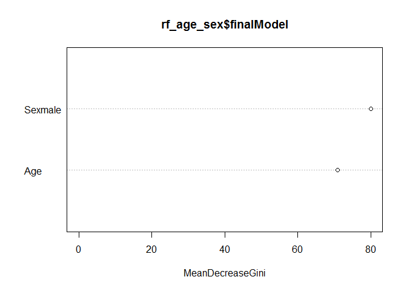
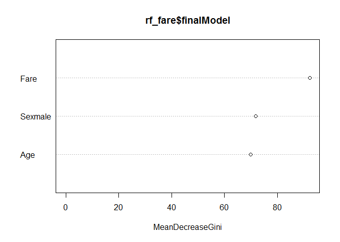
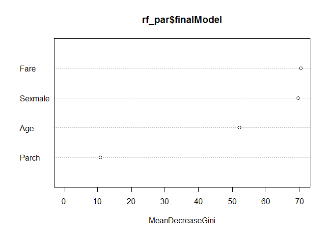

Titanic Decision Trees and Random Forests
================
Cheng Yee Lim
February 14, 2017

``` r
set.seed(1234) #reproducible results

titanic_split <- resample_partition(titanic_train,
                                    c(test = 0.3, train = 0.7)) #split 70/30 training/test set

titanic_train <- titanic_split$train %>%
  tbl_df() %>%
  select(Survived, Sex, Age, Parch, Fare) %>%
  na.omit() %>%
  mutate_each(funs(as.factor), Survived, Sex) #create clean dataset for rf analysis

titanic_test <- titanic_split$test %>%
  tbl_df() %>%
  select(Survived, Sex, Age, Parch, Fare) %>%
  na.omit() %>%
  mutate_each(funs(as.factor), Survived, Sex) #create clean dataset for rf analysis

titanic_train <- titanic_train %>%
  select(Survived, Sex, Age, Parch, Fare) %>%
  na.omit() %>%
  mutate_each(funs(as.factor), Survived, Sex) #create clean dataset for rf analysis
```

Logistic Regression Models
--------------------------

Estimate three different logistic regression models using the training set with Survived as the response variable. Calculate the test set accuracy rate for each logistic regression model. Which performs the best?

### Model 1 - Age, Sex

``` r
age_sex <- glm(Survived ~ Age + Sex, 
               data = titanic_train, 
               family = binomial)
summary(age_sex)
```

    ## 
    ## Call:
    ## glm(formula = Survived ~ Age + Sex, family = binomial, data = titanic_train)
    ## 
    ## Deviance Residuals: 
    ##     Min       1Q   Median       3Q      Max  
    ## -1.7885  -0.6857  -0.6772   0.6837   1.8007  
    ## 
    ## Coefficients:
    ##              Estimate Std. Error z value Pr(>|z|)    
    ## (Intercept)  1.376270   0.284458   4.838 1.31e-06 ***
    ## Age         -0.001307   0.007671  -0.170    0.865    
    ## Sexmale     -2.672766   0.228740 -11.685  < 2e-16 ***
    ## ---
    ## Signif. codes:  0 '***' 0.001 '**' 0.01 '*' 0.05 '.' 0.1 ' ' 1
    ## 
    ## (Dispersion parameter for binomial family taken to be 1)
    ## 
    ##     Null deviance: 687.03  on 504  degrees of freedom
    ## Residual deviance: 516.27  on 502  degrees of freedom
    ## AIC: 522.27
    ## 
    ## Number of Fisher Scoring iterations: 4

### Model 2 - Age, Sex, Fare

``` r
fare <- glm(Survived ~ Age + Sex + Fare, 
               data = titanic_train, 
               family = binomial)
summary(fare)
```

    ## 
    ## Call:
    ## glm(formula = Survived ~ Age + Sex + Fare, family = binomial, 
    ##     data = titanic_train)
    ## 
    ## Deviance Residuals: 
    ##     Min       1Q   Median       3Q      Max  
    ## -2.3617  -0.6450  -0.6008   0.7308   1.9744  
    ## 
    ## Coefficients:
    ##              Estimate Std. Error z value Pr(>|z|)    
    ## (Intercept)  1.116504   0.293630   3.802 0.000143 ***
    ## Age         -0.007926   0.008010  -0.990 0.322393    
    ## Sexmale     -2.545776   0.233666 -10.895  < 2e-16 ***
    ## Fare         0.011923   0.003422   3.484 0.000493 ***
    ## ---
    ## Signif. codes:  0 '***' 0.001 '**' 0.01 '*' 0.05 '.' 0.1 ' ' 1
    ## 
    ## (Dispersion parameter for binomial family taken to be 1)
    ## 
    ##     Null deviance: 687.03  on 504  degrees of freedom
    ## Residual deviance: 496.10  on 501  degrees of freedom
    ## AIC: 504.1
    ## 
    ## Number of Fisher Scoring iterations: 5

### Model 3 - Age, Sex, Fare, Parents/Children

``` r
parents <- glm(Survived ~ Age + Sex + Fare + Parch, 
               data = titanic_train, 
               family = binomial)
summary(parents)
```

    ## 
    ## Call:
    ## glm(formula = Survived ~ Age + Sex + Fare + Parch, family = binomial, 
    ##     data = titanic_train)
    ## 
    ## Deviance Residuals: 
    ##     Min       1Q   Median       3Q      Max  
    ## -2.3275  -0.6614  -0.5899   0.7070   2.0065  
    ## 
    ## Coefficients:
    ##              Estimate Std. Error z value Pr(>|z|)    
    ## (Intercept)  1.374666   0.319093   4.308 1.65e-05 ***
    ## Age         -0.011653   0.008303  -1.404 0.160466    
    ## Sexmale     -2.672742   0.245570 -10.884  < 2e-16 ***
    ## Fare         0.014369   0.003743   3.839 0.000123 ***
    ## Parch       -0.310661   0.138706  -2.240 0.025110 *  
    ## ---
    ## Signif. codes:  0 '***' 0.001 '**' 0.01 '*' 0.05 '.' 0.1 ' ' 1
    ## 
    ## (Dispersion parameter for binomial family taken to be 1)
    ## 
    ##     Null deviance: 687.03  on 504  degrees of freedom
    ## Residual deviance: 491.01  on 500  degrees of freedom
    ## AIC: 501.01
    ## 
    ## Number of Fisher Scoring iterations: 5

### Model Accuracy

``` r
test_accuracy <- function(model) {
  value <- titanic_test %>%
    add_predictions(model) %>%
    mutate(pred = logit2prob(pred),
           pred = as.numeric(pred > .5))
    mean(value$Survived == value$pred, na.rm = TRUE)
} #calculating test set accuracy for log reg 

test_accuracy(age_sex)
```

    ## [1] 0.7511962

``` r
test_accuracy(fare)
```

    ## [1] 0.7416268

``` r
test_accuracy(parents)
```

    ## [1] 0.7559809

| Model                            | Test Set Accuracy |
|----------------------------------|:-----------------:|
| Age, sex                         |     0.7511962     |
| Age, sex, fare                   |     0.7416268     |
| Age, sex, fare, parents/children |     0.7559809     |

The logistic model with age, sex, fare and parents/children performed best, followed by the model with age and sex only, and lastly, the model with age, sex and fare.

Random Forests
--------------

Now estimate three random forest models using the same model specifications as the logistic regression models. Generate variable importance plots for each random forest model. Which variables seem the most important? Calculate the test set accuracy rate for each random forest model. Which performs the best?

### Training with Age and Sex

``` r
rf_age_sex <- train(Survived ~ Age + Sex, data = titanic_train,
                   method = "rf",
                   ntree = 500,
                   trControl = trainControl(method = "oob"))
```

    ## note: only 1 unique complexity parameters in default grid. Truncating the grid to 1 .

``` r
rf_age_sex$finalModel
```

    ## 
    ## Call:
    ##  randomForest(x = x, y = y, ntree = 500, mtry = param$mtry) 
    ##                Type of random forest: classification
    ##                      Number of trees: 500
    ## No. of variables tried at each split: 2
    ## 
    ##         OOB estimate of  error rate: 24.36%
    ## Confusion matrix:
    ##     0   1 class.error
    ## 0 241  52   0.1774744
    ## 1  71 141   0.3349057

In the model with age and sex, sex was more important than age for surivval.

### Training with Age, Sex and Fare

``` r
rf_fare <- train(Survived ~ Age + Sex + Fare, data = titanic_train,
                   method = "rf",
                   ntree = 500,
                   trControl = trainControl(method = "oob"))
```

    ## note: only 2 unique complexity parameters in default grid. Truncating the grid to 2 .

``` r
rf_fare$finalModel
```

    ## 
    ## Call:
    ##  randomForest(x = x, y = y, ntree = 500, mtry = param$mtry) 
    ##                Type of random forest: classification
    ##                      Number of trees: 500
    ## No. of variables tried at each split: 2
    ## 
    ##         OOB estimate of  error rate: 21.58%
    ## Confusion matrix:
    ##     0   1 class.error
    ## 0 242  51   0.1740614
    ## 1  58 154   0.2735849

### Training with Age, Sex, Fare and Number of Parents/Children aboard

``` r
rf_par <- train(Survived ~ Age + Sex + Fare + Parch, data = titanic_train,
                   method = "rf",
                   ntree = 500,
                   trControl = trainControl(method = "oob"))

rf_par$finalModel
```

    ## 
    ## Call:
    ##  randomForest(x = x, y = y, ntree = 500, mtry = param$mtry) 
    ##                Type of random forest: classification
    ##                      Number of trees: 500
    ## No. of variables tried at each split: 2
    ## 
    ##         OOB estimate of  error rate: 18.22%
    ## Confusion matrix:
    ##     0   1 class.error
    ## 0 256  37   0.1262799
    ## 1  55 157   0.2594340

Variable Importance
-------------------

``` r
varImpPlot(rf_age_sex$finalModel)
```



In the model with age and sex, sex was more important than age for surivval.

``` r
varImpPlot(rf_fare$finalModel)
```



In the model with age, sex, and fare, fare was more important than age and sex for survival. Sex was slightly more important than age for survival.

``` r
varImpPlot(rf_par$finalModel)
```



In the model with age, sex, fare and parents/children aboard, fare and sex were the most important variables, followed by age, and number of parents/children aboard in predicting survival.

Test Set Accuracy
-----------------

``` r
test_acc_rf <- function(model_rf) {
  value <- titanic_test %>% 
  bind_cols(predict(model_rf, newdata = titanic_test, type = "prob")) %>% 
  rename(prob_dead = `0`,
         prob_survive = `1`) %>% 
  mutate(pred_survive = ifelse(prob_survive>0.5, 1, 0))
  mean(value$Survived == value$pred_survive, na.rm = TRUE)
} #calculating test set accuracy for rf 

test_acc_rf(rf_age_sex)
```

    ## [1] 0.7320574

``` r
test_acc_rf(rf_fare)
```

    ## [1] 0.7511962

``` r
test_acc_rf(rf_par)
```

    ## [1] 0.7751196

| Random Forest Model              | Test Set Accuracy |
|----------------------------------|:-----------------:|
| Age, sex                         |     0.7615894     |
| Age, sex, fare                   |     0.8013245     |
| Age, sex, fare, parents/children |     0.8344371     |

The model with age, sex, fare and number of parents/children aboard was the best in predicting survival, with the highest test set accuracy of 0.834. The model with age, sex and fare was the second best, with a test set accuracy of 0.801. Lastly, the model with only sex and age had a test set accuracy of 0.762.

Logistic Regression vs. Random Forests
--------------------------------------

Compare the test set accuracy rates between the logistic regression and random forest models. Which method (logistic regression or random forest) performed better?

| Type                | Model                                   | Test Set Accuracy |
|---------------------|-----------------------------------------|:-----------------:|
| Logistic Regression | Age, sex                                |     0.7511962     |
| Logistic Regression | Age, sex, fare                          |     0.7416268     |
| Logistic Regression | Age, sex, fare, parents/cihldren aboard |     0.7559809     |
| Random Forest       | Age, sex                                |     0.7615894     |
| Random Forest       | Age, sex, fare                          |     0.8013245     |
| Random Forest       | Age, sex, fare, parents/children aboard |     0.8344371     |

Random Forests have performed better than logistic regression models for all models. In fact, a poorer specification (i.e. a model with age and sex only) in random forests was already a better model in predicting survival than all models estimated with a logistic regression.
