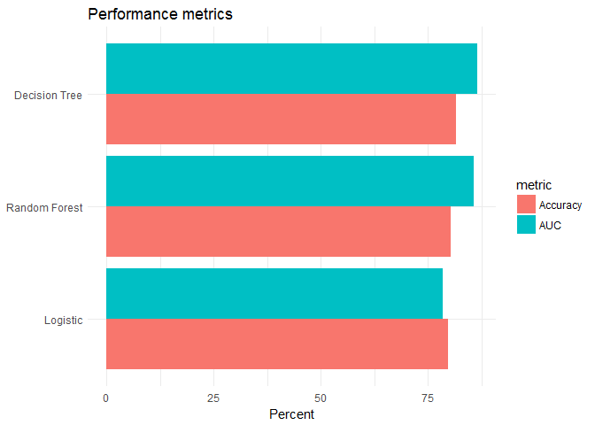

Resampling methods and distributed learning
================
Cheng Yee Lim
February 20, 2017

``` r
knitr::opts_chunk$set(
  cache = TRUE, 
  message = FALSE, 
  warning = FALSE
  )

library(tidyverse)
library(modelr)
library(broom)
library(knitr)
library(pander)
library(titanic)
library(sparklyr)
library(purrr)
library(profvis)
sc <- spark_connect(master = "local")
options(na.action = na.omit)
set.seed(1234)
theme_set(theme_minimal())
```

Question 1: Single Linear Regression
------------------------------------

``` r
#function and import 
mse <- function(model, data) {
  x <- modelr:::residuals(model, data)
  mean(x ^ 2, na.rm = TRUE)
} #function to calculate MSE

joe_lm <- function(df){
  lm <- lm(biden ~ . , data = df)
} #lm with all variables as independent vars

joe <- read.csv("./data/biden.csv") %>%
  na.omit() #import data, remove missing obs
```

### Estimate the model using the entire set of observations and calculate the MSE.

``` r
pander(summary(joe_lm(joe))) #results of linear regression
```

<table style="width:86%;">
<colgroup>
<col width="25%" />
<col width="15%" />
<col width="18%" />
<col width="13%" />
<col width="13%" />
</colgroup>
<thead>
<tr class="header">
<th align="center"> </th>
<th align="center">Estimate</th>
<th align="center">Std. Error</th>
<th align="center">t value</th>
<th align="center">Pr(&gt;|t|)</th>
</tr>
</thead>
<tbody>
<tr class="odd">
<td align="center"><strong>female</strong></td>
<td align="center">4.092</td>
<td align="center">0.9464</td>
<td align="center">4.323</td>
<td align="center">1.62e-05</td>
</tr>
<tr class="even">
<td align="center"><strong>pid</strong></td>
<td align="center">-15.61</td>
<td align="center">0.618</td>
<td align="center">-25.25</td>
<td align="center">9.889e-121</td>
</tr>
<tr class="odd">
<td align="center"><strong>age</strong></td>
<td align="center">0.04738</td>
<td align="center">0.02793</td>
<td align="center">1.697</td>
<td align="center">0.08996</td>
</tr>
<tr class="even">
<td align="center"><strong>educ</strong></td>
<td align="center">-0.3479</td>
<td align="center">0.1943</td>
<td align="center">-1.79</td>
<td align="center">0.07358</td>
</tr>
<tr class="odd">
<td align="center"><strong>(Intercept)</strong></td>
<td align="center">74.37</td>
<td align="center">3.1</td>
<td align="center">23.99</td>
<td align="center">1.263e-110</td>
</tr>
</tbody>
</table>

<table style="width:85%;">
<caption>Fitting linear model: biden ~ .</caption>
<colgroup>
<col width="20%" />
<col width="30%" />
<col width="11%" />
<col width="22%" />
</colgroup>
<thead>
<tr class="header">
<th align="center">Observations</th>
<th align="center">Residual Std. Error</th>
<th align="center"><span class="math inline"><em>R</em><sup>2</sup></span></th>
<th align="center">Adjusted <span class="math inline"><em>R</em><sup>2</sup></span></th>
</tr>
</thead>
<tbody>
<tr class="odd">
<td align="center">1807</td>
<td align="center">19.91</td>
<td align="center">0.2815</td>
<td align="center">0.2799</td>
</tr>
</tbody>
</table>

``` r
mse(joe_lm(joe), joe) #calculate mse
```

    ## [1] 395.2798

#### Estimate the model using the validation set approach (70/30 training/test split) and calculate the MSE.

``` r
joe_split <- resample_partition(joe, c(test = 0.7, train = 0.3))
joe_train <- joe_split$train %>%
  tbl_df()
joe_test <- joe_split$test %>%
  tbl_df()
pander(summary(joe_lm(joe_train))) #results of 70/30 training/test split
```

<table style="width:86%;">
<colgroup>
<col width="25%" />
<col width="15%" />
<col width="18%" />
<col width="13%" />
<col width="13%" />
</colgroup>
<thead>
<tr class="header">
<th align="center"> </th>
<th align="center">Estimate</th>
<th align="center">Std. Error</th>
<th align="center">t value</th>
<th align="center">Pr(&gt;|t|)</th>
</tr>
</thead>
<tbody>
<tr class="odd">
<td align="center"><strong>female</strong></td>
<td align="center">4.847</td>
<td align="center">1.759</td>
<td align="center">2.756</td>
<td align="center">0.006055</td>
</tr>
<tr class="even">
<td align="center"><strong>pid</strong></td>
<td align="center">-15.31</td>
<td align="center">1.107</td>
<td align="center">-13.83</td>
<td align="center">2.012e-37</td>
</tr>
<tr class="odd">
<td align="center"><strong>age</strong></td>
<td align="center">0.05357</td>
<td align="center">0.05338</td>
<td align="center">1.004</td>
<td align="center">0.3161</td>
</tr>
<tr class="even">
<td align="center"><strong>educ</strong></td>
<td align="center">0.03672</td>
<td align="center">0.3879</td>
<td align="center">0.09467</td>
<td align="center">0.9246</td>
</tr>
<tr class="odd">
<td align="center"><strong>(Intercept)</strong></td>
<td align="center">68.21</td>
<td align="center">5.995</td>
<td align="center">11.38</td>
<td align="center">5.006e-27</td>
</tr>
</tbody>
</table>

<table style="width:85%;">
<caption>Fitting linear model: biden ~ .</caption>
<colgroup>
<col width="20%" />
<col width="30%" />
<col width="11%" />
<col width="22%" />
</colgroup>
<thead>
<tr class="header">
<th align="center">Observations</th>
<th align="center">Residual Std. Error</th>
<th align="center"><span class="math inline"><em>R</em><sup>2</sup></span></th>
<th align="center">Adjusted <span class="math inline"><em>R</em><sup>2</sup></span></th>
</tr>
</thead>
<tbody>
<tr class="odd">
<td align="center">543</td>
<td align="center">20.37</td>
<td align="center">0.2759</td>
<td align="center">0.2705</td>
</tr>
</tbody>
</table>

``` r
mse(joe_lm(joe_train), joe_test)
```

    ## [1] 390.0078

#### Estimate the model using the LOOCV approach and calculate the MSE.

``` r
LOOCV <- function(df, n){
  #create loocv data
  loocv_data <- crossv_kfold(df, n)
  #regress every loocv datapoint
  loocv_mods <- map(loocv_data$train, ~ lm(biden ~ . , data = .))
  #calculate mse for every loocv datapoint
  loocv_mse <- map2_dbl(loocv_mods, loocv_data$test, mse)
  #mse of loocv is the average of every mse calculated
  print(mean(loocv_mse, na.rm = TRUE))
} #function to calculate mse for k-fold loocv approach, where max k = nrow(df)

loocv_joe <- LOOCV(joe, nrow(joe))
```

    ## [1] 397.4816

#### Estimate the model using the 10-fold CV approach and calculate the MSE.

``` r
kfold_joe <- LOOCV(joe, 10)
```

    ## [1] 397.7451

#### Report on any discrepancies or differences between the estimated MSEs and briefly explain why they may differ from one another.

| Model               |     MSE     |
|---------------------|:-----------:|
| 100% train          | 395.2798242 |
| 70% train, 30% test | 390.0077583 |
| LOOCV               | 397.4815654 |
| 10-fold CV          | 397.7450986 |

As expected, the estimated MSE using all the observations (baseline) in the dataset is smaller then LOOCV and 10-fold CV as the regression. This is because the model trained with all the observations so MSE at all points is minimized. Whenever we conduct LOOCV or 10-fold CV, we train with less observations, n-1 observations for LOOCV and 90% of the observations for 10-fold CV. Thus, estimated MSE will be smallest for 100% training model, followed by LOOCV model and 10-fold CV model. The estimated MSE will always be the same for LOOCV. But the estimated MSE will vary for k-fold CV models and training-test split models depending on the value of k and the training-test split in the model.

In the case of 70/30 training/test split model, the estimated MSE is slightly smaller than the other models by chance. We will probably get an estimated MSE closer to the baseline using a different seed.

Question 2: Titanic Logistic Regression Models
----------------------------------------------

#### Estimate the models using the entire set of obserations and calculate the MSE of each model.

``` r
mse.glm <- function (model, data){
  residuals.glm <- function(model, data) {
    modelr:::response(model, data) - stats::predict(model, data, type = "response")
  }
  
  x <- residuals(model, data)
  mean(x^2, na.rm = TRUE)
} #mse.glm function 
```

### Model 1 - Age, Sex

``` r
age_sex <- glm(Survived ~ Age + Sex, 
               data = titanic_train, 
               family = binomial)
pander(summary(age_sex))
```

<table style="width:86%;">
<colgroup>
<col width="25%" />
<col width="15%" />
<col width="18%" />
<col width="13%" />
<col width="13%" />
</colgroup>
<thead>
<tr class="header">
<th align="center"> </th>
<th align="center">Estimate</th>
<th align="center">Std. Error</th>
<th align="center">z value</th>
<th align="center">Pr(&gt;|z|)</th>
</tr>
</thead>
<tbody>
<tr class="odd">
<td align="center"><strong>Age</strong></td>
<td align="center">-0.005426</td>
<td align="center">0.00631</td>
<td align="center">-0.8599</td>
<td align="center">0.3898</td>
</tr>
<tr class="even">
<td align="center"><strong>Sexmale</strong></td>
<td align="center">-2.466</td>
<td align="center">0.1854</td>
<td align="center">-13.3</td>
<td align="center">2.262e-40</td>
</tr>
<tr class="odd">
<td align="center"><strong>(Intercept)</strong></td>
<td align="center">1.277</td>
<td align="center">0.2302</td>
<td align="center">5.549</td>
<td align="center">2.868e-08</td>
</tr>
</tbody>
</table>

(Dispersion parameter for binomial family taken to be 1 )

<table style="width:61%;">
<colgroup>
<col width="26%" />
<col width="34%" />
</colgroup>
<tbody>
<tr class="odd">
<td align="center">Null deviance:</td>
<td>964.5 on 713 degrees of freedom</td>
</tr>
<tr class="even">
<td align="center">Residual deviance:</td>
<td>750.0 on 711 degrees of freedom</td>
</tr>
</tbody>
</table>

``` r
mse.glm(age_sex, titanic_train)
```

    ## [1] 0.1710442

### Model 2 - Age, Sex, Fare

``` r
fare <- glm(Survived ~ Age + Sex + Fare, 
               data = titanic_train, 
               family = binomial)
pander(summary(fare))
```

<table style="width:86%;">
<colgroup>
<col width="25%" />
<col width="15%" />
<col width="18%" />
<col width="13%" />
<col width="13%" />
</colgroup>
<thead>
<tr class="header">
<th align="center"> </th>
<th align="center">Estimate</th>
<th align="center">Std. Error</th>
<th align="center">z value</th>
<th align="center">Pr(&gt;|z|)</th>
</tr>
</thead>
<tbody>
<tr class="odd">
<td align="center"><strong>Age</strong></td>
<td align="center">-0.01057</td>
<td align="center">0.006498</td>
<td align="center">-1.627</td>
<td align="center">0.1038</td>
</tr>
<tr class="even">
<td align="center"><strong>Sexmale</strong></td>
<td align="center">-2.348</td>
<td align="center">0.19</td>
<td align="center">-12.36</td>
<td align="center">4.373e-35</td>
</tr>
<tr class="odd">
<td align="center"><strong>Fare</strong></td>
<td align="center">0.01277</td>
<td align="center">0.002696</td>
<td align="center">4.738</td>
<td align="center">2.157e-06</td>
</tr>
<tr class="even">
<td align="center"><strong>(Intercept)</strong></td>
<td align="center">0.9348</td>
<td align="center">0.2391</td>
<td align="center">3.91</td>
<td align="center">9.237e-05</td>
</tr>
</tbody>
</table>

(Dispersion parameter for binomial family taken to be 1 )

<table style="width:61%;">
<colgroup>
<col width="26%" />
<col width="34%" />
</colgroup>
<tbody>
<tr class="odd">
<td align="center">Null deviance:</td>
<td>964.5 on 713 degrees of freedom</td>
</tr>
<tr class="even">
<td align="center">Residual deviance:</td>
<td>716.1 on 710 degrees of freedom</td>
</tr>
</tbody>
</table>

``` r
mse.glm(fare, titanic_train)
```

    ## [1] 0.1633723

### Model 3 - Age, Sex, Fare, Parents/Children

``` r
parents <- glm(Survived ~ Age + Sex + Fare + Parch, 
               data = titanic_train, 
               family = binomial)
pander(summary(parents))
```

<table style="width:86%;">
<colgroup>
<col width="25%" />
<col width="15%" />
<col width="18%" />
<col width="13%" />
<col width="13%" />
</colgroup>
<thead>
<tr class="header">
<th align="center"> </th>
<th align="center">Estimate</th>
<th align="center">Std. Error</th>
<th align="center">z value</th>
<th align="center">Pr(&gt;|z|)</th>
</tr>
</thead>
<tbody>
<tr class="odd">
<td align="center"><strong>Age</strong></td>
<td align="center">-0.01447</td>
<td align="center">0.006751</td>
<td align="center">-2.143</td>
<td align="center">0.03213</td>
</tr>
<tr class="even">
<td align="center"><strong>Sexmale</strong></td>
<td align="center">-2.487</td>
<td align="center">0.1999</td>
<td align="center">-12.44</td>
<td align="center">1.65e-35</td>
</tr>
<tr class="odd">
<td align="center"><strong>Fare</strong></td>
<td align="center">0.01508</td>
<td align="center">0.002908</td>
<td align="center">5.187</td>
<td align="center">2.139e-07</td>
</tr>
<tr class="even">
<td align="center"><strong>Parch</strong></td>
<td align="center">-0.3275</td>
<td align="center">0.1136</td>
<td align="center">-2.884</td>
<td align="center">0.003932</td>
</tr>
<tr class="odd">
<td align="center"><strong>(Intercept)</strong></td>
<td align="center">1.218</td>
<td align="center">0.2618</td>
<td align="center">4.654</td>
<td align="center">3.253e-06</td>
</tr>
</tbody>
</table>

(Dispersion parameter for binomial family taken to be 1 )

<table style="width:61%;">
<colgroup>
<col width="26%" />
<col width="34%" />
</colgroup>
<tbody>
<tr class="odd">
<td align="center">Null deviance:</td>
<td>964.5 on 713 degrees of freedom</td>
</tr>
<tr class="even">
<td align="center">Residual deviance:</td>
<td>707.4 on 709 degrees of freedom</td>
</tr>
</tbody>
</table>

``` r
mse.glm(parents, titanic_train)
```

    ## [1] 0.1613147

#### Estimate the models using 10-fold CV and calculate the MSE of each model. How do these values compare to the original estimates using the full dataset? Which model performs the best?

``` r
#split the data
titanic_split <- resample_partition(titanic_train, c(test = 0.7, train = 0.3))
t_train <- titanic_split$train %>%
  na.omit() %>%
  tbl_df()
t_test <- titanic_split$test %>%
  na.omit() %>%
  tbl_df()

#model1 
LOOCV_agesex  <- function(df, n){
  loocv_data <- crossv_kfold(df, n)
  loocv_mods <- map(loocv_data$train, ~ glm(Survived ~ Age + Sex, family = binomial, data = .))
  loocv_mse <- map2_dbl(loocv_mods, loocv_data$test, mse.glm)
  mean(loocv_mse, na.rm = TRUE)
} #function to calculate mse for k-fold loocv approach for model 1

kfold_agesex <- LOOCV_agesex(t_train, 10)

#model2
LOOCV_fare  <- function(df, n){
  loocv_data <- crossv_kfold(df, n)
  loocv_mods <- map(loocv_data$train, ~ glm(Survived ~ Age + Sex + Fare, family = binomial, data = .))
  loocv_mse <- map2_dbl(loocv_mods, loocv_data$test, mse.glm)
  mean(loocv_mse, na.rm = TRUE)
} #function to calculate mse for k-fold loocv approach for model2

kfold_fare <- LOOCV_fare(t_train, 10)

#model3
LOOCV_par  <- function(df, n){
  loocv_data <- crossv_kfold(df, n)
  loocv_mods <- map(loocv_data$train, ~ glm(Survived ~ Age + Sex + Fare + Parch, family = binomial, data = .))
  loocv_mse <- map2_dbl(loocv_mods, loocv_data$test, mse.glm)
  mean(loocv_mse, na.rm = TRUE)
} #function to calculate mse for k-fold loocv approach for model3

kfold_par <- LOOCV_par(t_train, 10)
```

| Type                    | 100% Training MSE | 10-fold CV MSE |
|-------------------------|:-----------------:|:--------------:|
| Age, sex                |     0.1710442     |    0.1546341   |
| Age, sex, fare          |     0.1633723     |    0.1511235   |
| Age, sex, fare, parents |     0.1613147     |    0.1507882   |

The MSE calculated for all three models using 10-fold CV are smaller than the MSE calculated for all three models without cross validation. Model 3 performs best in both methods.

#### Take the model that performs the best and estimate bootstrap standard errors for the parameters. Are there significant differences between the standard errors from the original model trained on all the data vs. the bootstrap estimates?

``` r
library(titanic)
# basic model
titanic_glm <- glm(Survived ~ Age + Sex + Fare + Parch, data = titanic_train, family = binomial)
pander(summary(titanic_glm))
```

<table style="width:86%;">
<colgroup>
<col width="25%" />
<col width="15%" />
<col width="18%" />
<col width="13%" />
<col width="13%" />
</colgroup>
<thead>
<tr class="header">
<th align="center"> </th>
<th align="center">Estimate</th>
<th align="center">Std. Error</th>
<th align="center">z value</th>
<th align="center">Pr(&gt;|z|)</th>
</tr>
</thead>
<tbody>
<tr class="odd">
<td align="center"><strong>Age</strong></td>
<td align="center">-0.01447</td>
<td align="center">0.006751</td>
<td align="center">-2.143</td>
<td align="center">0.03213</td>
</tr>
<tr class="even">
<td align="center"><strong>Sexmale</strong></td>
<td align="center">-2.487</td>
<td align="center">0.1999</td>
<td align="center">-12.44</td>
<td align="center">1.65e-35</td>
</tr>
<tr class="odd">
<td align="center"><strong>Fare</strong></td>
<td align="center">0.01508</td>
<td align="center">0.002908</td>
<td align="center">5.187</td>
<td align="center">2.139e-07</td>
</tr>
<tr class="even">
<td align="center"><strong>Parch</strong></td>
<td align="center">-0.3275</td>
<td align="center">0.1136</td>
<td align="center">-2.884</td>
<td align="center">0.003932</td>
</tr>
<tr class="odd">
<td align="center"><strong>(Intercept)</strong></td>
<td align="center">1.218</td>
<td align="center">0.2618</td>
<td align="center">4.654</td>
<td align="center">3.253e-06</td>
</tr>
</tbody>
</table>

(Dispersion parameter for binomial family taken to be 1 )

<table style="width:61%;">
<colgroup>
<col width="26%" />
<col width="34%" />
</colgroup>
<tbody>
<tr class="odd">
<td align="center">Null deviance:</td>
<td>964.5 on 713 degrees of freedom</td>
</tr>
<tr class="even">
<td align="center">Residual deviance:</td>
<td>707.4 on 709 degrees of freedom</td>
</tr>
</tbody>
</table>

``` r
#bootstrap
t_train %>%
  modelr::bootstrap(1000) %>%
  mutate(model = map(strap, ~ glm(Survived ~ Age + Sex + Fare + Parch, data = .,
                                  family = binomial)),
         coef = map(model, tidy)) %>%
  unnest(coef) %>%
  group_by(term) %>%
  summarize(est.boot = mean(estimate),
            se.boot = sd(estimate, na.rm = TRUE)) %>%
  kable()
```

| term        |    est.boot|    se.boot|
|:------------|-----------:|----------:|
| (Intercept) |   1.8162647|  0.6605663|
| Age         |  -0.0425759|  0.0176110|
| Fare        |   0.0206653|  0.0061793|
| Parch       |  -0.2324004|  0.2292937|
| Sexmale     |  -2.8063334|  0.4218768|

There are significant differences between the standard errors from the original model trained on all the data and the bootstrap estimated standard errors. The estimated standard errors from the bootstrap are significantly larger than the standard errors from the original model.

Question 3: Sparklyr
--------------------

Take the model specification for your best-performing model from the Titanic problem, and estimate it using the random forest, decision tree, and logistic regression machine learning algorithms in sparklyr. Calculate the accuracy and AUC metrics for each model. Which algorithm performs the best?

``` r
titanic_glm <- glm(Survived ~ Age + Sex + Fare + Parch, data = titanic_train, family = binomial)

#load the data 
partition <- copy_to(sc, titanic::titanic_train, "titanic", overwrite = TRUE) %>%
#tidy the data and transformations
  filter(!is.na(Survived) & !is.na(Age) & !is.na(Sex) & !is.na(Fare) & !is.na(Parch)) %>%
  sdf_register("titanic2") %>%
#train-validation split
  mutate(Survived = as.numeric(Survived), 
         Age = as.numeric(Age), 
         Fare = as.numeric(Fare), 
         Parch = as.numeric(Parch)) %>%
  select(Survived, Sex, Age, Parch, Fare) %>%
  sdf_partition(train = 0.75, test = 0.25, seed = 1234)

#create table references 
train_tbl <- partition$train
test_tbl <- partition$test

#train the models 
# Logistic reg
ml_formula <- formula(Survived ~ Age + Sex + Fare + Parch)
ml_log <- ml_logistic_regression(train_tbl, ml_formula)

# Decision Tree
ml_dt <- ml_decision_tree(train_tbl, ml_formula)

# Random Forest
ml_rf <- ml_random_forest(train_tbl, ml_formula)

#validation data 
# Bundle the models into a single list object
ml_models <- list(
  "Logistic" = ml_log,
  "Decision Tree" = ml_dt,
  "Random Forest" = ml_rf
)

# Create a function for scoring
score_test_data <- function(model, data=test_tbl){
  pred <- sdf_predict(model, data)
  select(pred, Survived, prediction)
}

# Score all the models
ml_score <- map(ml_models, score_test_data)

# Function for calculating accuracy
calc_accuracy <- function(data, cutpoint = 0.5){
  data %>% 
    mutate(prediction = if_else(prediction > cutpoint, 1.0, 0.0)) %>%
    ml_classification_eval("prediction", "Survived", "accuracy")
}

# Calculate AUC and accuracy
perf_metrics <- data_frame(
  model = names(ml_score),
  AUC = 100 * map_dbl(ml_score, ml_binary_classification_eval, "Survived", "prediction"),
  Accuracy = 100 * map_dbl(ml_score, calc_accuracy))
kable(perf_metrics)
```

| model         |       AUC|  Accuracy|
|:--------------|---------:|---------:|
| Logistic      |  78.51800|  79.62963|
| Decision Tree |  86.50460|  81.48148|
| Random Forest |  85.58516|  80.24691|

``` r
# Plot results
gather(perf_metrics, metric, value, AUC, Accuracy) %>%
  ggplot(aes(reorder(model, value), value, fill = metric)) + 
  geom_bar(stat = "identity", position = "dodge") + 
  coord_flip() +
  labs(title = "Performance metrics",
       x = NULL,
       y = "Percent")
```



The decision tree algorithm performs the best in both accuracy and AUC. The random forest algorithm trails closely behind.
