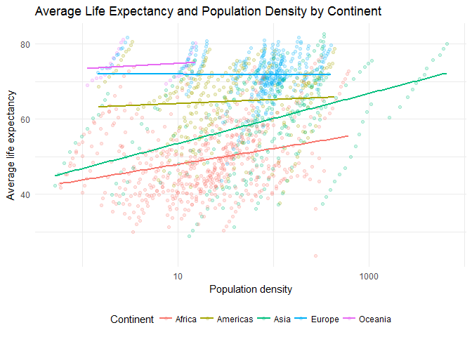

Further exploration of Gapminder data
================
Cheng Yee Lim
February 28, 2017

``` r
knitr::opts_chunk$set(
  cache = TRUE, 
  message = FALSE, 
  warning = FALSE
  )

library(tidyverse)
library(gapminder)
library(geonames)
library(countrycode)
library(knitr)

theme_set(theme_minimal())
```

To investigate the relationship between population density and average life expectancy, we have merge data from `gapminder` and country information from `geonames`. However, there isn't a unique identifier for the two datasets. Upon identifying the problem, we leverage on the `countrycode` library to create a unique identifier, `countryCode`, which is also the ISO-2 character country code, to merge both datasets.

``` r
countryInfo <- GNcountryInfo() #obtain country info from geonames
kable(head(countryInfo))
```

| continent | capital          | languages         | geonameId | south            | isoAlpha3 | north            | fipsCode | population | east              | isoNumeric | areaInSqKm | countryCode | west              | countryName                     | continentName | currencyCode |
|:----------|:-----------------|:------------------|:----------|:-----------------|:----------|:-----------------|:---------|:-----------|:------------------|:-----------|:-----------|:------------|:------------------|:--------------------------------|:--------------|:-------------|
| EU        | Andorra la Vella | ca                | 3041565   | 42.4284925987684 | AND       | 42.6560438963    | AN       | 84000      | 1.78654277783198  | 020        | 468.0      | AD          | 1.40718671411128  | Principality of Andorra         | Europe        | EUR          |
| AS        | Abu Dhabi        | ar-AE,fa,en,hi,ur | 290557    | 22.6333293914795 | ARE       | 26.0841598510742 | AE       | 4975593    | 56.3816604614258  | 784        | 82880.0    | AE          | 51.5833282470703  | United Arab Emirates            | Asia          | AED          |
| AS        | Kabul            | fa-AF,ps,uz-AF,tk | 1149361   | 29.377472        | AFG       | 38.483418        | AF       | 29121286   | 74.879448         | 004        | 647500.0   | AF          | 60.478443         | Islamic Republic of Afghanistan | Asia          | AFN          |
| NA        | Saint John’s     | en-AG             | 3576396   | 16.996979        | ATG       | 17.729387        | AC       | 86754      | -61.672421        | 028        | 443.0      | AG          | -61.906425        | Antigua and Barbuda             | North America | XCD          |
| NA        | The Valley       | en-AI             | 3573511   | 18.1602929743117 | AIA       | 18.2769019716581 | AV       | 13254      | -62.9665554457795 | 660        | 102.0      | AI          | -63.1680898960388 | Anguilla                        | North America | XCD          |
| EU        | Tirana           | sq,el             | 783754    | 39.6448624829142 | ALB       | 42.6611669383269 | AL       | 2986952    | 21.0574334835312  | 008        | 28748.0    | AL          | 19.2639112711741  | Republic of Albania             | Europe        | ALL          |

``` r
iso2c <- countrycode_data %>% 
  select(country.name.en, iso2c) %>% #use countrycode iso2c as unique identifier between gapminder and geonames
  rename(country = country.name.en,
         countryCode = iso2c) #rename columns to match with gapminder and geonames
kable(head(iso2c))
```

| country        | countryCode |
|:---------------|:------------|
| Afghanistan    | AF          |
| Aland Islands  | AX          |
| Albania        | AL          |
| Algeria        | DZ          |
| American Samoa | AS          |
| Andorra        | AD          |

``` r
gapminder <- gapminder %>%
  left_join(iso2c, by = "country") #merge gapminder with unique identifer iso2c
kable(head(gapminder))
```

| country     | continent |  year|  lifeExp|       pop|  gdpPercap| countryCode |
|:------------|:----------|-----:|--------:|---------:|----------:|:------------|
| Afghanistan | Asia      |  1952|   28.801|   8425333|   779.4453| AF          |
| Afghanistan | Asia      |  1957|   30.332|   9240934|   820.8530| AF          |
| Afghanistan | Asia      |  1962|   31.997|  10267083|   853.1007| AF          |
| Afghanistan | Asia      |  1967|   34.020|  11537966|   836.1971| AF          |
| Afghanistan | Asia      |  1972|   36.088|  13079460|   739.9811| AF          |
| Afghanistan | Asia      |  1977|   38.438|  14880372|   786.1134| AF          |

``` r
gapminder <- gapminder[, c(7,1,2,3,4,5,6)] %>%
  left_join(countryInfo, by = "countryCode") #merge gapminder and geonames info with countrycode (iso2c)
kable(head(gapminder))
```

| countryCode | country     | continent.x |  year|  lifeExp|       pop|  gdpPercap| continent.y | capital | languages         | geonameId | south     | isoAlpha3 | north     | fipsCode | population | east      | isoNumeric | areaInSqKm | west      | countryName                     | continentName | currencyCode |
|:------------|:------------|:------------|-----:|--------:|---------:|----------:|:------------|:--------|:------------------|:----------|:----------|:----------|:----------|:---------|:-----------|:----------|:-----------|:-----------|:----------|:--------------------------------|:--------------|:-------------|
| AF          | Afghanistan | Asia        |  1952|   28.801|   8425333|   779.4453| AS          | Kabul   | fa-AF,ps,uz-AF,tk | 1149361   | 29.377472 | AFG       | 38.483418 | AF       | 29121286   | 74.879448 | 004        | 647500.0   | 60.478443 | Islamic Republic of Afghanistan | Asia          | AFN          |
| AF          | Afghanistan | Asia        |  1957|   30.332|   9240934|   820.8530| AS          | Kabul   | fa-AF,ps,uz-AF,tk | 1149361   | 29.377472 | AFG       | 38.483418 | AF       | 29121286   | 74.879448 | 004        | 647500.0   | 60.478443 | Islamic Republic of Afghanistan | Asia          | AFN          |
| AF          | Afghanistan | Asia        |  1962|   31.997|  10267083|   853.1007| AS          | Kabul   | fa-AF,ps,uz-AF,tk | 1149361   | 29.377472 | AFG       | 38.483418 | AF       | 29121286   | 74.879448 | 004        | 647500.0   | 60.478443 | Islamic Republic of Afghanistan | Asia          | AFN          |
| AF          | Afghanistan | Asia        |  1967|   34.020|  11537966|   836.1971| AS          | Kabul   | fa-AF,ps,uz-AF,tk | 1149361   | 29.377472 | AFG       | 38.483418 | AF       | 29121286   | 74.879448 | 004        | 647500.0   | 60.478443 | Islamic Republic of Afghanistan | Asia          | AFN          |
| AF          | Afghanistan | Asia        |  1972|   36.088|  13079460|   739.9811| AS          | Kabul   | fa-AF,ps,uz-AF,tk | 1149361   | 29.377472 | AFG       | 38.483418 | AF       | 29121286   | 74.879448 | 004        | 647500.0   | 60.478443 | Islamic Republic of Afghanistan | Asia          | AFN          |
| AF          | Afghanistan | Asia        |  1977|   38.438|  14880372|   786.1134| AS          | Kabul   | fa-AF,ps,uz-AF,tk | 1149361   | 29.377472 | AFG       | 38.483418 | AF       | 29121286   | 74.879448 | 004        | 647500.0   | 60.478443 | Islamic Republic of Afghanistan | Asia          | AFN          |

``` r
gapminder %>%
  mutate(popd = pop/as.numeric(areaInSqKm)) %>% #convert to population in population density
  ggplot(aes(popd, lifeExp, color = continent.x)) + 
  geom_point(alpha = .2) +
  geom_smooth(method = "lm", se = FALSE) +
  scale_x_log10() +
  labs(title = "Average Life Expectancy and Population Density by Continent",
       x = "Population density",
       y = "Average life expectancy",
       color = "Continent") + 
  theme(legend.position = "bottom")
```



Our graph shows that there is a positive relationship between average life expectancy and population in Africa and ASia continent. However, an increase in population density in Americas, Europe and Oceania does not result in an improvement in average life expectancy. This could be explained by the nature of countries in the different regions. Africa and Asia have a higher proportion of developing countries in their continent, than Americas, Europe and Oceania. An increase in population density is often a result of urbanization, which also corresponds with an improvement in amenities and living standards in the country, thus resulting in a rise average life expectancy. On the other hand, continents with a high proportion of developed countries in the continent are already urbanized and an increase in population density may only reflect migration flows or increasing birth rates, which is uncorrelated with average life expectancy.
