Web Scraping
================
Cheng Yee Lim
February 28, 2017

``` r
knitr::opts_chunk$set(
  cache = TRUE, 
  message = FALSE, 
  warning = FALSE
  )

library(rvest)
library(stringr)
library(tidyverse)
library(tidytext)
library(countrycode)
library(neat)
library(lubridate)
library(broom)
library(scales)
library(wordcloud)
library(reshape2)
library(knitr)
library(httr)

theme_set(theme_minimal())
```

Web Scraping
------------

For this web scraping assignment, I decided to scrape [TeleGeography's CommsUpdate](https://www.telegeography.com/products/commsupdate/), which is daily summary of the world' top telecom news stories. Each news article on Commsupdate contains information on the headline of the article, content of the article, country involved in the article, date the article is published. I chose to scrape the webpage by country, as the url systematically changes for each country and the webpage shows all the articles related to the country from 2003.

#### Identifying URL patterns

An example of the url format is <https://www.telegeography.com/products/commsupdate/lists/country/united-kingdom/> This webpage contains all the telecommunication news articles on United Kingdom from 2003 to present day. We can then infer that to view all the news articles from Hong Kong, we will change the last component of the url from united-kingdom to hong-kong. Below is the function I have written to modify the url for each country.

``` r
#function to create customized url for each country
url <- function(Country){
  baseurl <- "https://www.telegeography.com/products/commsupdate/lists/country/" #unchanging portion of url
  values <- c(Country) 
  str_c(baseurl, values) #add country to the end of the url
}
```

#### Creating list of countries

However, the tricky part of scraping this website was that the website did not provide a list of all countries they have reported articles on. Thus, I had to come up with a list of countries and try to scrape the website with every possible country in the world. I created the list of country names by leveraging on `country.name.en`, a list of country names in English from `countrycode` library. Since we are dealing with strings, I had to ensure that the names were of lowercase and replaced all the spaces with hyphens.

``` r
# function to create list of country names from countrycode lib
stringdf <- function(column){
  ctry_names <- countrycode_data[column] # selecting column of english country names
  ctry_list <- split(ctry_names$country.name.en, seq(nrow(ctry_names))) %>% 
    tolower() # convert df to lowercase strings
  ctryname <- str_replace(ctry_list, " ", "-") #replace spaces with - to match url 
}
```

#### For loop and scraping function

Then, I wrote a `scrape` function to web scrape and a `for` loop to scrape data from the list of possible urls and ensured that when an error occurred (i.e. the listed country did not have reported articles on TeleGeography), we will just move on to the next possible url.

``` r
#function to scrape data
scrape <- function(url, country){
  tele <- read_html(url)
  
  date <- tele %>%
    html_nodes(".article-date") %>%
    html_text() 
  
  title <- tele %>%
    html_nodes(".article-title") %>%
    html_text()

  ctry <- sample(toupper(country), length(title), replace = TRUE)
  df <- data.frame(country = ctry, date = date, title = title) 
}

# scraping website for all countries
countryname <- stringdf('country.name.en') #create list of country names from countrycode lib

for(i in 1:length(countryname)){
  url_list <- url(countryname[i])
  df <- try(scrape(url_list, countryname[i]), silent = TRUE) 
  if('try-error' %in% class(df)) next #skipping country names not featured in the website 
  else if(i == 1){
    df1 <- df
  }
  
  else{
    df1 <- bind_rows(df, df1)
  }
}
```

Our webscraping code, thus far, led to the following dataframe:

``` r
kable(head(df1))
```

| country  | date        | title                                                         |
|:---------|:------------|:--------------------------------------------------------------|
| ZIMBABWE | 16 Feb 2017 | TelOne hopes to recover USD165m of debt in 2017               |
| ZIMBABWE | 14 Feb 2017 | Econet owed USD25m by state-run operators                     |
| ZIMBABWE | 9 Feb 2017  | Govt to use USD250m from USF for shared mobile infrastructure |
| ZIMBABWE | 7 Feb 2017  | Zimbabwe used USF to help buy Telecel stake                   |
| ZIMBABWE | 31 Jan 2017 | NetOne pays renewal fee deposit                               |
| ZIMBABWE | 26 Jan 2017 | NSSA wants Telecel exit in three years                        |

#### Tidying Data and Adding Supplementing Variables

To conduct further exploratory analysis with the web scraped data, I added supplementary information on country characteristics, such as country income group and country region, from the World Bank country metadata. I created a unique identifier, `iso3c`, from the `countrycode` library to merge the World Bank metadata with the webscraped data.

``` r
# creating unique identifier
uniq <- data.frame(country = countrycode_data['country.name.en'], 
                   countrycode = countrycode_data['iso3c']) %>%
  purrr::set_names(c("country", "countrycode")) %>%
  mutate(country = str_to_title(country))

# transform data for merge
df1 <- df1 %>%
  mutate(year = as.numeric(str_sub(date, -4))) %>%
  mutate(country = str_replace(country, "-", " ")) %>%
  mutate(country = str_to_title(country))

# combine iso3c with countries
df <- left_join(df1, uniq, by = "country")

# supplementary information on countries 
vars <- read_csv("./data/Metadata_Country_API_IT.NET.USER.P2_DS2_en_csv_v2.csv")[ , c(1:3)] %>%
  purrr::set_names(c("countrycode", "region", "incomegroup"))

# combine supp info with scraped data
df_final <- left_join(df[, c(5,1,4,3,2)], vars, by = "countrycode")

# tidy data 
tele_news <- df_final %>%
  na.omit() %>% #remove observations without region and income group
  mutate(year = as.numeric(str_sub(date, -4)), 
         region = as.factor(region),
         incomegroup = as.factor(incomegroup)) 
```

Therefore, our final dataset consists of 59420 observations from 177 countries and contains the following information:

``` r
kable(head(tele_news))
```

| countrycode | country  |  year| title                                                         | date        | region             | incomegroup |
|:------------|:---------|-----:|:--------------------------------------------------------------|:------------|:-------------------|:------------|
| ZWE         | Zimbabwe |  2017| TelOne hopes to recover USD165m of debt in 2017               | 16 Feb 2017 | Sub-Saharan Africa | Low income  |
| ZWE         | Zimbabwe |  2017| Econet owed USD25m by state-run operators                     | 14 Feb 2017 | Sub-Saharan Africa | Low income  |
| ZWE         | Zimbabwe |  2017| Govt to use USD250m from USF for shared mobile infrastructure | 9 Feb 2017  | Sub-Saharan Africa | Low income  |
| ZWE         | Zimbabwe |  2017| Zimbabwe used USF to help buy Telecel stake                   | 7 Feb 2017  | Sub-Saharan Africa | Low income  |
| ZWE         | Zimbabwe |  2017| NetOne pays renewal fee deposit                               | 31 Jan 2017 | Sub-Saharan Africa | Low income  |
| ZWE         | Zimbabwe |  2017| NSSA wants Telecel exit in three years                        | 26 Jan 2017 | Sub-Saharan Africa | Low income  |

Exploratory Data Analysis of Telecommunication News Articles
------------------------------------------------------------

Our preliminary data exploration shows that higher income countries have more telecommunication news reporting on TeleGeography, which is unsurprising. Higher income countries often have more resources to invest in infrastructure than lower income countries.

``` r
tele_news %>% 
  mutate(incomegroup = factor(incomegroup, levels = names(sort(table(incomegroup), decreasing = TRUE)))) %>%
  group_by(incomegroup) %>%
  na.omit() %>%
  arrange(incomegroup) %>%
  ggplot() + 
  geom_bar(aes(incomegroup), color = "cadetblue2", fill = "cadetblue2") + 
  labs(x = "Income Group Classifications",
       y = "Count", 
       title = "Telecommunication News Articles by Income Group Classifications")
```


Furthermore, there isn't a time trend in the number of telecommunication news articles over the years.

``` r
tele_news %>%
  group_by(year) %>%
  ggplot() + 
  geom_bar(aes(year), color = "#FF9999", fill = "#FF9999") + 
  labs(x = "Year",
       y = "Count", 
       title = "Telecommunication News Articles by Year")
```

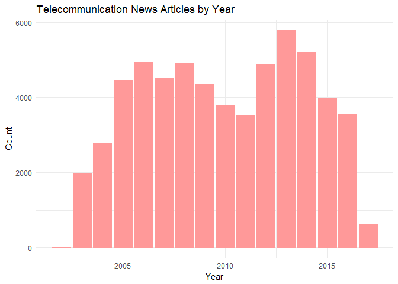

We also plot out the number of news articles reported by region.

``` r
tele_news %>%
  mutate(region = factor(region, levels = names(sort(table(region), decreasing = TRUE)))) %>%
  group_by(region) %>%
  na.omit() %>%
  ggplot() + 
  geom_bar(aes(region), fill = "palegreen2", color = "palegreen2") + 
  coord_flip() + 
  labs(x = "Region",
       y = "Count", 
       title = "Telecommunication News Articles by Region")
```

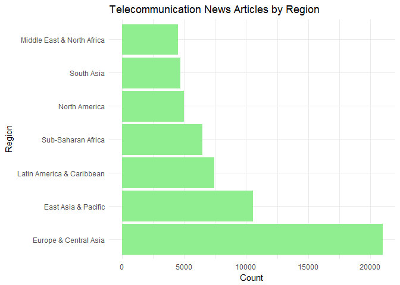

Analyzing News Article Headlines
--------------------------------

From eyeballing the headlines of different news articles, we can commonly identify names of telecommunication operators in different countries and some form of telecommunication technology. Thus, I attempt to extract the technology trends by analyzing the headlines of news articles across the years using the most common text analysis approach, bag-of-words model.

#### Reflection of telecommunication technology

From the word bubbles plotted out by high and low income countries over the years, we can identify the change in telecommunication technology from 3G to 4G and LTE. The shift from 3G to 4G and LTE began in 2010 in high income countries. 5G technology appeared in the news for the first time in 2016.

``` r
#function to plot word bubble across the years for high and low income countries
wordcloud_trend <- function(yr, ig1, ig2, tit){ 
  
  layout(matrix(c(1, 2), nrow=2), heights=c(1, 4)) #create layout to add customized title to each word bubble
  par(mar=rep(0, 4))
  plot.new()
  text(x=0.5, y=0.5, cex = 1.5, tit)
  
  tokens <- tele_news %>% #create separate words for headlines
    select(title, year, incomegroup) %>%
    filter(year == yr,
           incomegroup == ig1 | incomegroup == ig2) %>% 
    unnest_tokens(word, title) %>%
    filter(!word %in% stop_words$word, 
           str_detect(word, "[a-z]")) #remove stop words
  
  count(tokens, word) %>% #calculate frequency of each word
    with(wordcloud(word, n, max.word = 150, scale = c(3, .5), main = "Title")) #plot wordcloud 
}

#creating list of years
year <- 2003:2016
#creating list of titles 
high_inc <- str_c("High Income Countries Word Bubble", year, sep = " ")
low_inc <- str_c("Low Income Countries Word Bubble", year, sep = " ")
#income group inputs for wordcloud_trend function
high <- "High income"
upp <- "Upper middle income"
mid <- "Lower middle income"
low <- "Low income"

for(i in seq_along(year)){
  wordcloud_trend(year[i], high, upp, high_inc[i])
}
```

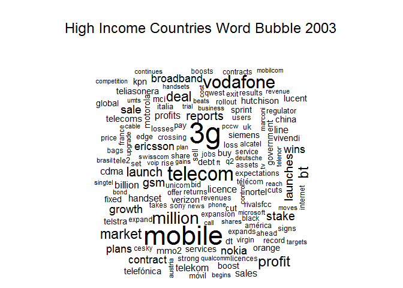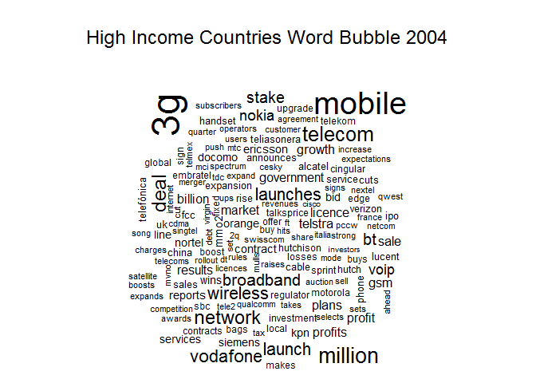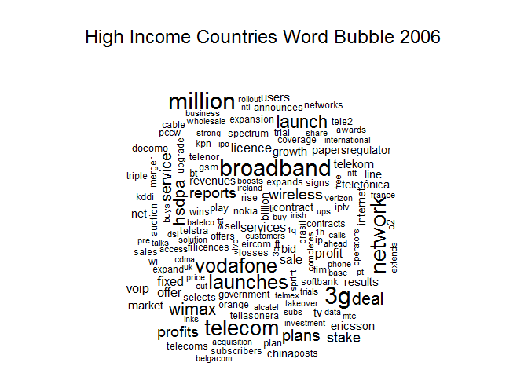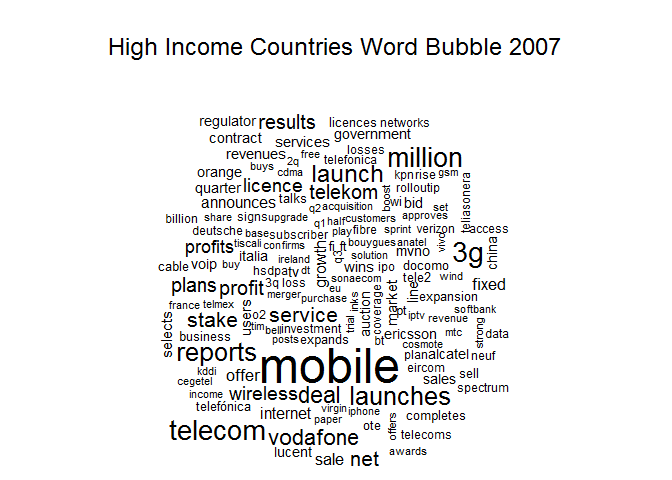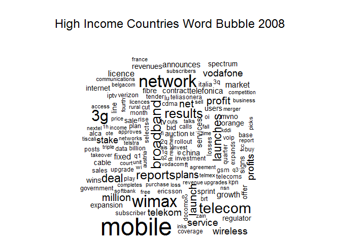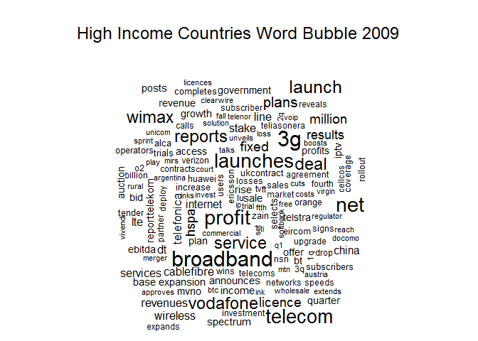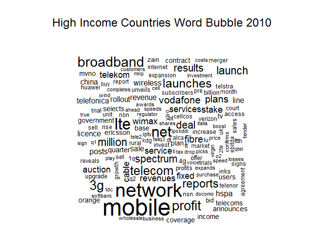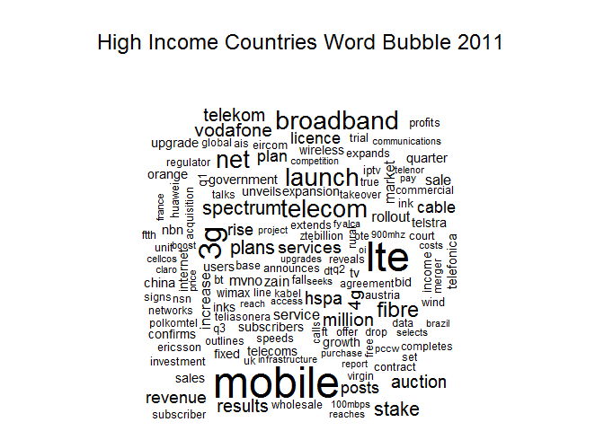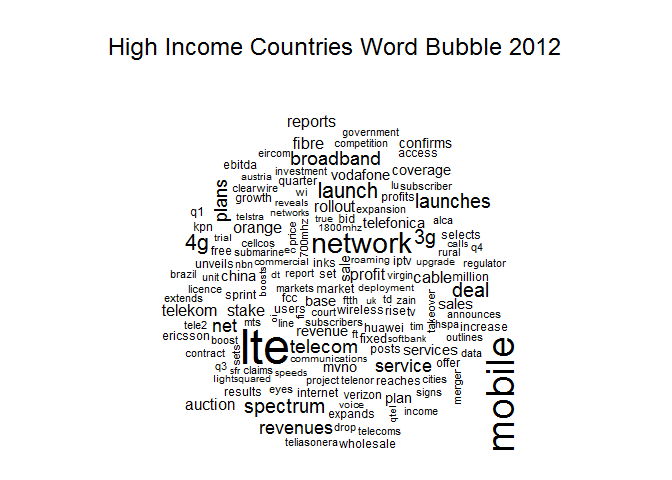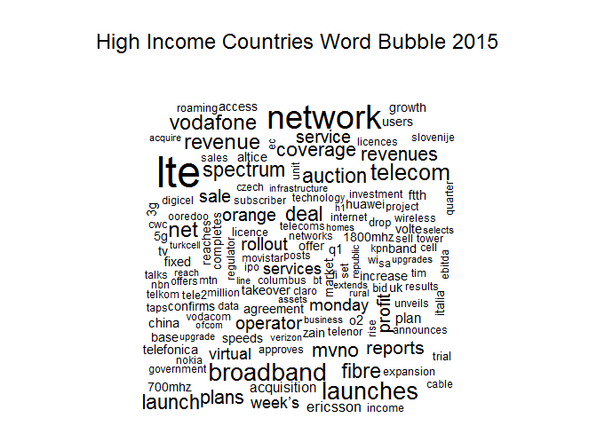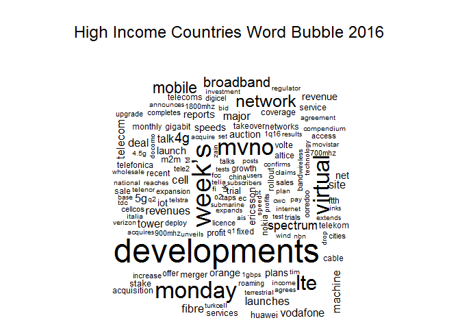

In contrast, lower income countries only started reporting news articles on 4G in 2013. However, for both low and high income countries, there is an increased reporting on network and broadband over the years.

``` r
for(i in seq_along(year)){
  wordcloud_trend(year[i], low, mid, low_inc[i])
}
```

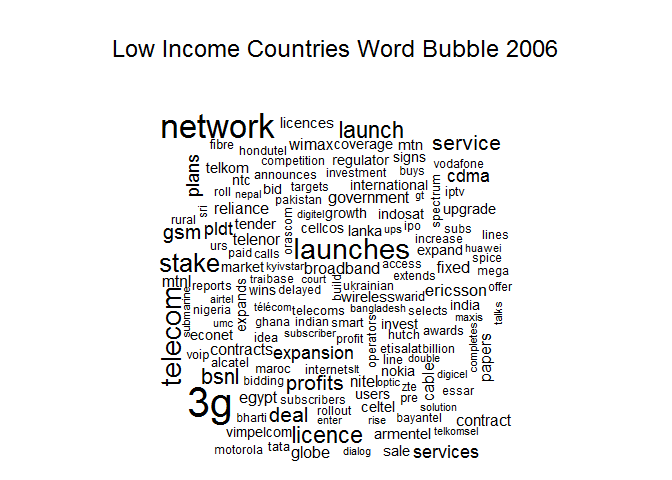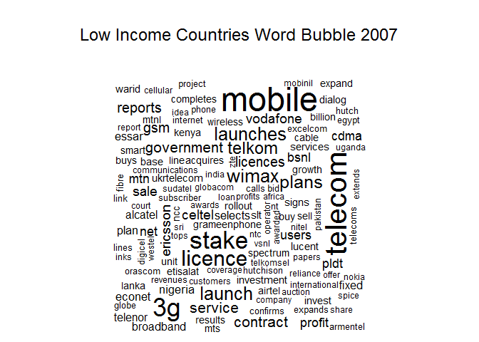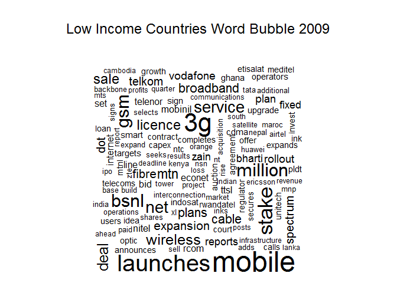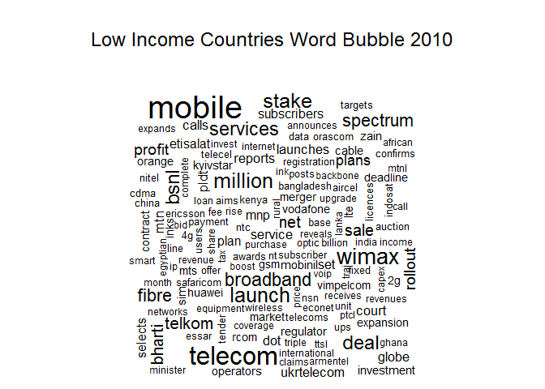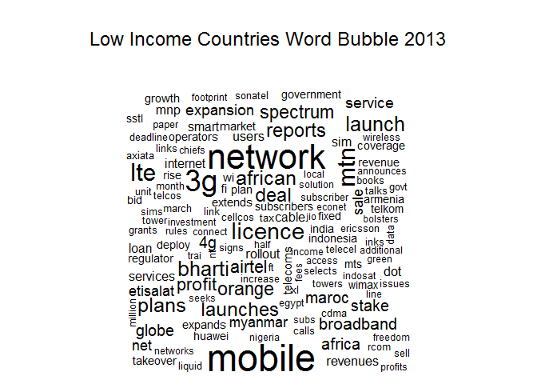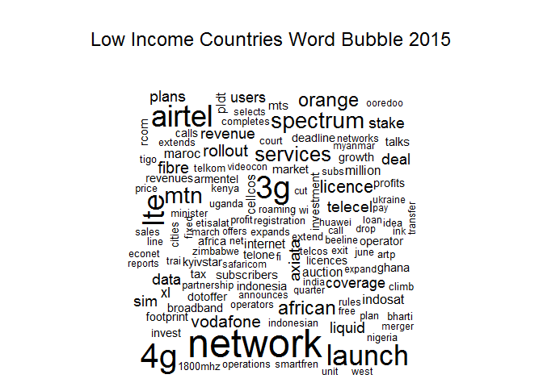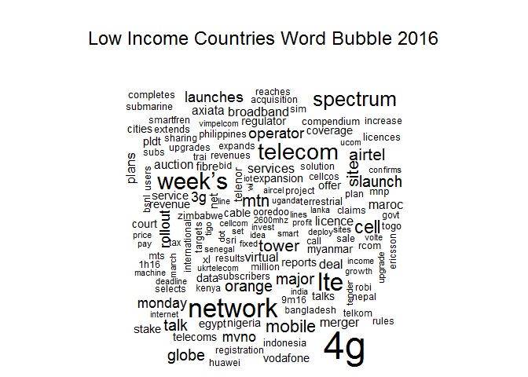
